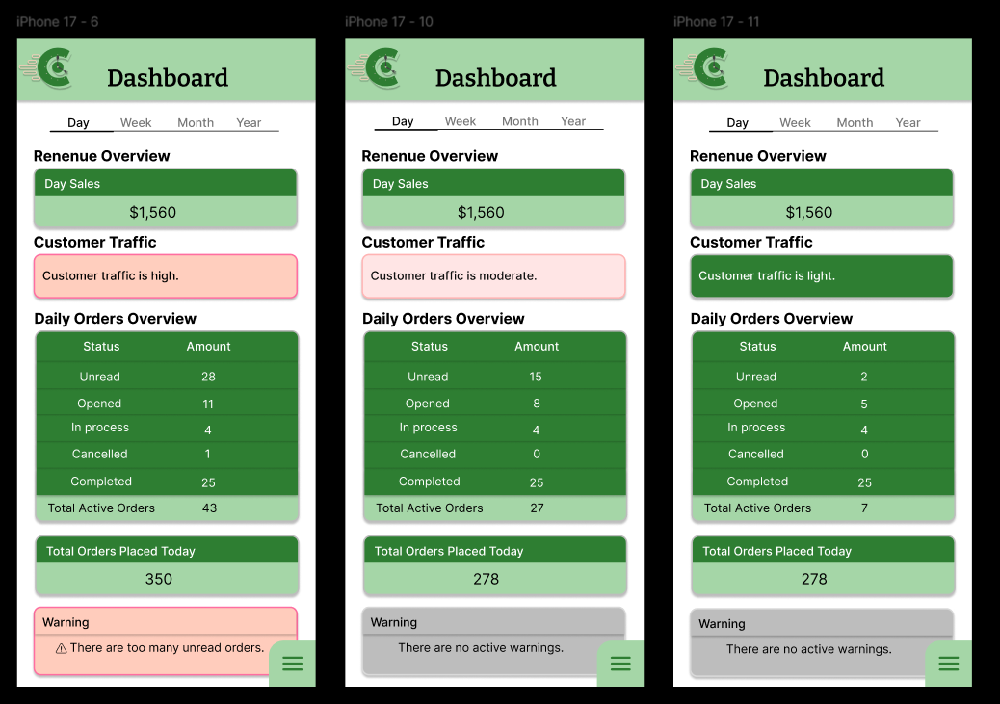
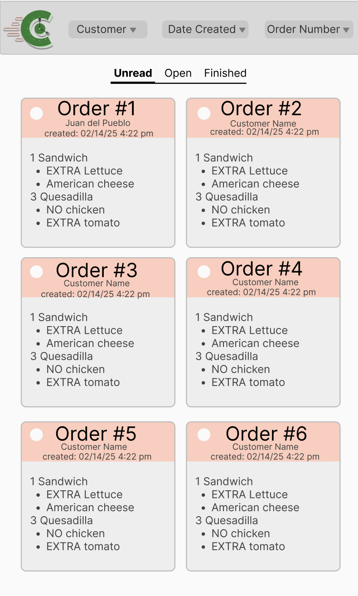

= User-Centered Design Review for Staff Dashboard & Order Handling
:toc:
:toclevels: 3

== User-Centered Design in Staff Operations

User-Centered Design (UCD) is a design approach focused on understanding user behaviors, needs, limitations, and workflows throughout the development process.

Within cafeteria staff operations, UCD should focus on:

* improving operational efficiency
* reducing mental load
* supporting rapid decision-making
* improving visibility of operational information
* reducing workflow interruption
* minimizing operational mistakes during high-pressure situations

A staff-side operational interface should prioritize clarity, responsiveness, and ease of interaction over visual complexity.

== Staff User Needs During Cafeteria Operations

Staff members interacting with the dashboard and order management interfaces require rapid access to operational information while minimizing unnecessary interaction steps.

Core staff needs include:

* quickly identifying incoming orders
* understanding current queue conditions
* monitoring active order states
* identifying delayed or problematic orders
* navigating the interface efficiently during rush periods
* updating order statuses with minimal effort
* locating specific orders quickly
* maintaining awareness of operational workload

Because cafeteria staff often multitask during food preparation and order coordination, interfaces should prioritize fast recognition and operational clarity rather than excessive interaction or dense navigation structures.

== Staff Expectations for Operational Dashboards

Staff members typically expect operational dashboards and order management systems to provide:

* clear visual hierarchy
* rapid access to important information
* immediate feedback after interactions
* predictable workflow behavior
* simple navigation
* minimal operational ambiguity

Operational interfaces are generally expected to prioritize functionality and readability over decorative complexity.

In fast-paced environments, staff members are more likely to value:

* quick status visibility
* responsive interactions
* reduced interaction count
* obvious queue prioritization
* immediate warning indicators
* efficient order scanning

== Current Staff Dashboard Design Example

== Current Order Management Interface Example

== Analysis of Staff Workflow Behaviors

=== Order Intake

Staff members must quickly recognize and process incoming customer orders.

The current interfaces support this through:

* order overview visibility
* categorized order tabs
* active order statistics
* unread order indicators
* warning notifications
* visual separation between order cards

Potential usability strengths include:

* centralized operational visibility
* simplified status categorization
* readable card separation
* quick access to operational summaries
* visibility of customer and order information

Potential concerns include:

* excessive visual scanning during high-order-volume scenarios
* unread orders becoming difficult to prioritize
* dense order-card information increasing mental load
* limited visual prioritization for urgent orders
* difficulty rapidly distinguishing similar active orders

=== Food Preparation Coordination

Operational coordination requires staff members to continuously monitor active order progression while preparing multiple orders simultaneously.

Current workflows support this through:

* categorized order states
* active order summaries
* visible order details

Potential usability strengths include:

* simplified operational categorization
* centralized workflow monitoring
* visibility of item modifiers and preparation notes

Potential concerns include:

* detailed order contents may become visually overwhelming during rush periods
* dashboard summaries alone may not sufficiently support operational prioritization
* repeated order-card layouts may increase scanning fatigue

=== Status Updates

Staff members responsible for order handling must transition orders between operational states efficiently.

Potential usability strengths include:

* simplified workflow states
* grouped operational tabs
* reduced navigation complexity

Potential concerns include:

* accidental status transitions during rapid interaction
* insufficient confirmation feedback after updates
* unclear visibility regarding recently modified orders
* possible confusion between completed and active orders during peak-hour conditions

=== Filtering and Order Navigation

The interface includes filtering controls for customer names, creation dates, and order numbers.

Potential usability strengths include:

* improved operational organization
* faster order lookup
* support for locating specific operational information
* reduced manual queue scanning

Potential concerns include:

* dropdown-heavy interaction increasing operational friction
* unclear active filter visibility
* excessive interaction steps during rush periods
* filtering complexity for inexperienced staff users

=== Rush-Hour Management

Peak operational periods significantly increase mental load and interaction pressure.

Potential usability strengths include:

* operational warning panels
* visibility of active order counts
* categorized operational states
* centralized dashboard metrics

Potential concerns include:

* excessive vertical scrolling during large queue volumes
* visual overcrowding caused by multiple dense order cards
* reduced visibility of newly arriving orders
* difficulty distinguishing critical operational information quickly

=== Order Completion and Cancellation Handling

Operational workflows must support fast recovery from cancellations or incomplete order states.

Potential concerns include:

* unclear cancellation visibility
* accidental completion of incorrect orders
* insufficient differentiation between active and resolved operational states
* reduced visibility of delayed or problematic orders

== Information Hierarchy and Readability

The interfaces demonstrate strong emphasis on visibility through:

* large operational summary panels
* bold order identifiers
* separated dashboard sections
* categorized operational tabs
* structured order cards

Positive readability characteristics include:

* clear order numbering
* visible order totals
* organized grouping of operational information
* readable section separation

However, several readability concerns may still exist.

Potential concerns include:

* heavy reliance on color alone for urgency communication
* possible accessibility limitations
* item modifiers visually blending into order contents
* detailed order cards competing equally for attention
* insufficient visual distinction between urgent and non-urgent orders

Additional hierarchy improvements may help staff members scan operational information more efficiently during busy conditions.

== Workflow Simplification Opportunities

Several opportunities exist for simplifying staff-side workflows and reducing operational friction.

Potential improvements include:

* reducing interactions required for status updates
* adding quick-action operational controls
* improving prioritization indicators for unread or delayed orders
* visually highlighting recently updated orders
* adding queue filtering and sorting shortcuts
* improving distinction between active and resolved operational states
* collapsing detailed order contents until needed
* adding pinned or prioritized urgent orders

Workflow simplification may improve:

* operational speed
* queue readability
* staff awareness
* error prevention
* operational consistency

== Growth Path from New to Experienced Staff

The interface should support both first-time and experienced cafeteria staff members.

For new users, the interface should prioritize:

* intuitive navigation
* clear terminology
* obvious operational workflows
* reduced learning difficulty
* simplified operational feedback

For experienced staff users, the interface should support:

* rapid operational interaction
* minimal unnecessary confirmations
* efficient queue handling
* fast information scanning
* quick operational decision-making

A well-designed operational interface should allow users to gradually transition from guided interaction to high-speed operational efficiency.

== Potential Usability Friction Points

Potential usability friction points identified during analysis include:

* excessive visual scanning during rush periods
* limited queue prioritization indicators
* operational overload caused by dense order-card layouts
* repeated scrolling during large queue volumes
* possible accidental status transitions
* insufficient distinction between critical and non-critical operational information
* dropdown filtering complexity
* accessibility limitations caused by heavy color dependence

These friction points may reduce operational efficiency and increase mental load during high-pressure cafeteria conditions.

== Recommendations for Improving User-Centered Design

The following recommendations may improve alignment with User-Centered Design principles:

* improve prioritization visibility for unread or delayed orders
* reduce unnecessary interaction steps for operational workflows
* strengthen confirmation feedback after status changes
* improve accessibility beyond color-based indicators
* introduce clearer visual hierarchy for urgent operational information
* add queue filtering and sorting shortcuts
* improve operational awareness during peak-hour conditions
* visually distinguish recently updated or modified orders
* implement collapsible order-card details
* improve visibility of delayed or problematic orders

These improvements may help reduce staff confusion while improving operational efficiency and usability.

== References

* Nielsen, J. (1994). Usability Engineering. Morgan Kaufmann.

* Norman, D. (2013). The Design of Everyday Things. Basic Books.

* Sommerville, I. (2015). Software Engineering (10th ed.). Pearson.