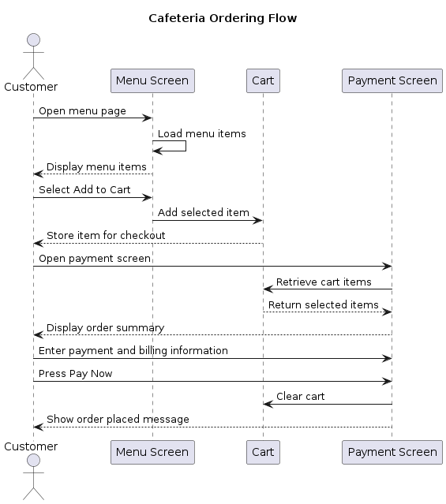

= BDD Specification for Ordering Flow
:toc:
:sectnums:

== Purpose

This document defines Behavior-Driven Development (BDD) scenarios for the ordering flow of the Cafeteria Mobile Ordering System. The goal is to describe how a customer interacts with the system when viewing menu items, adding items to the cart, reviewing the order, and completing payment.

== Scenarios

The scenarios in this document cover the following behaviors:

* Viewing menu items
* Adding a menu item to the cart
* Reviewing the order summary before payment
* Completing payment and placing the order

This document focuses only on the customer ordering flow.

== Ordering Flow Scenarios

=== Scenario 1: Customer views available menu items

Given the application is running  
And menu data is available  
When the customer navigates to the menu page  
Then the system should display a list of menu items  
And each visible menu item should provide an option to add it to the cart

=== Scenario 2: Customer adds a menu item to the cart

Given the customer is viewing the menu page  
And a menu item is available  
When the customer selects the Add to Cart option  
Then the selected menu item should be added to the cart  
And the item should be available for checkout

=== Scenario 3: Customer reviews the order summary

Given the customer has one or more items in the cart  
When the customer opens the payment screen  
Then the system should display the selected items  
And the system should show the quantity for each item  
And the system should show the subtotal  
And the system should show the total payment due

=== Scenario 4: Customer completes payment and places the order

Given the customer is on the payment screen  
And the customer has one or more items in the order summary  
And the customer has entered payment and billing information  
When the customer presses the Pay Now button  
Then the system should clear the cart  
And the system should show an order placed message

== Behavioral Diagram

[plantuml]
----
@startuml
title Cafeteria Ordering Flow

actor Customer

participant "Menu Screen" as Menu
participant "Cart" as Cart
participant "Payment Screen" as Payment

Customer -> Menu: Open menu page
Menu -> Menu: Load menu items
Menu --> Customer: Display menu items

Customer -> Menu: Select Add to Cart
Menu -> Cart: Add selected item
Cart --> Customer: Store item for checkout

Customer -> Payment: Open payment screen
Payment -> Cart: Retrieve cart items
Cart --> Payment: Return selected items
Payment --> Customer: Display order summary

Customer -> Payment: Enter payment and billing information
Customer -> Payment: Press Pay Now
Payment -> Cart: Clear cart
Payment --> Customer: Show order placed message

@enduml
----

== Diagram Explanation

The diagram shows the customer ordering flow using only behavior currently represented in the project files. The customer opens the menu page, views menu items, adds an item to the cart, opens the payment screen, reviews the order summary, enters payment information, and presses Pay Now. After payment, the cart is cleared and the system shows an order placed message.