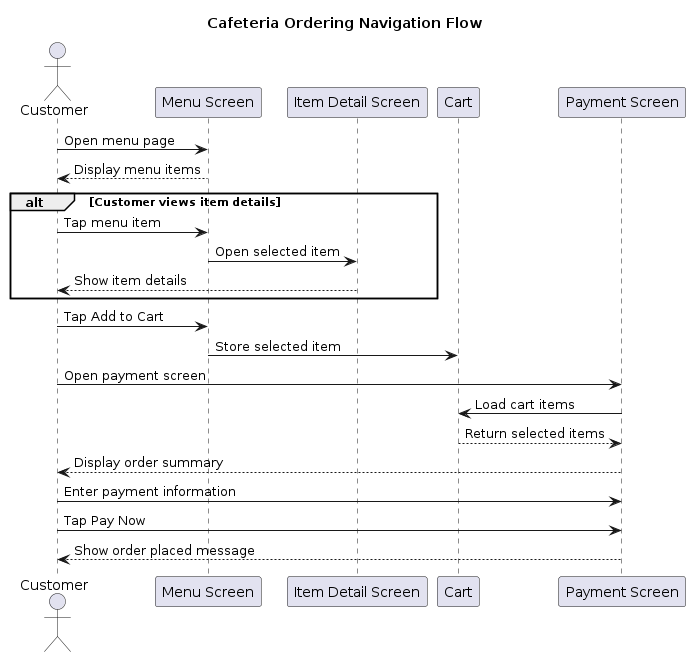

= Usability Evaluation and Navigation Analysis
:toc:
:sectnums:

== Objective

This report evaluates the usability of the Cafeteria Mobile Ordering System by reviewing navigation flow, readability, accessibility, and user interaction. The goal is to identify areas that work well and areas that could improve the overall user experience.

== Customer Ordering Flow Observations

This evaluation focuses on the following customer-facing ordering flow:

* Browsing menu items
* Adding items to the cart
* Viewing selected items before checkout
* Reviewing the payment screen
* Entering payment and billing information

== Navigation Flow Diagram

[plantuml]
----
@startuml
title Cafeteria Ordering Navigation Flow

actor Customer

participant "Menu Screen" as Menu
participant "Item Detail Screen" as Detail
participant "Cart" as Cart
participant "Payment Screen" as Payment

Customer -> Menu: Open menu page
Menu --> Customer: Display menu items

alt Customer views item details
  Customer -> Menu: Tap menu item
  Menu -> Detail: Open selected item
  Detail --> Customer: Show item details
end

Customer -> Menu: Tap Add to Cart
Menu -> Cart: Store selected item

Customer -> Payment: Open payment screen
Payment -> Cart: Load cart items
Cart --> Payment: Return selected items
Payment --> Customer: Display order summary

Customer -> Payment: Enter payment information
Customer -> Payment: Tap Pay Now
Payment --> Customer: Show order placed message

@enduml
----

== Usability Observations

=== Observation 1: Menu navigation is simple

The menu screen gives the customer a direct way to browse available items. Each menu item can be selected or added to the cart, which makes the first part of the ordering flow easy to understand.

Recommendation: Add a clear visual confirmation when an item is added to the cart, such as a short message or cart badge update.

=== Observation 2: The ordering flow is straightforward

The current navigation flow moves in a simple order from menu browsing to payment. Customers can move through the ordering process without unnecessary screens or complicated navigation paths.

Recommendation: Add a visible progress indicator or breadcrumb system so customers can more easily understand where they are in the ordering process. (Step 1: Menu, Step 2: Cart, Step 3: Payment)

=== Observation 3: Payment screen contains many fields

The payment screen includes the order summary, item removal, card information, billing address, and payment button. This is useful, but the screen may feel long for users.

Recommendation: Group the payment screen into clearer sections, such as Order Summary, Payment Method, Billing Address, and Confirmation.

=== Observation 4: Payment input formatting improves usability

The payment screen formats card number, expiration date, CVC, and ZIP code fields. This helps prevent invalid input and makes the form easier to complete.

Recommendation: Add validation messages if required fields are empty before the customer presses Pay Now.

== Accessibility and Readability Notes

* Text should remain readable in both light mode and dark mode.
* Important buttons should have clear labels.
* Error or confirmation messages should be written clearly.
* Icons should not be the only way to understand an action.

== Areas that could improve overall user experience

* Add feedback when an item is added to the cart.
* Add validation messages for missing payment fields.
* Keep payment sections visually separated.
* Make sure dark mode and light mode text contrast stays readable.