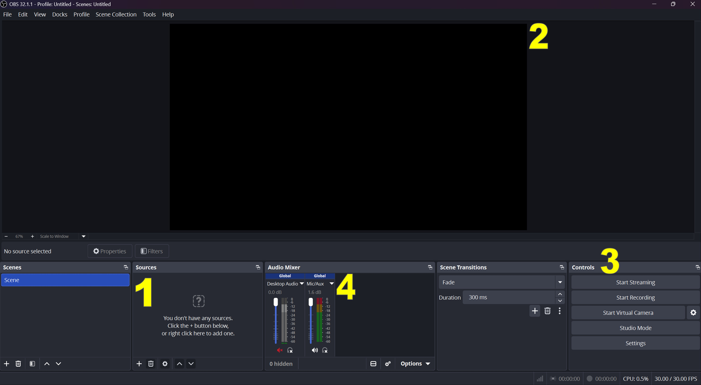
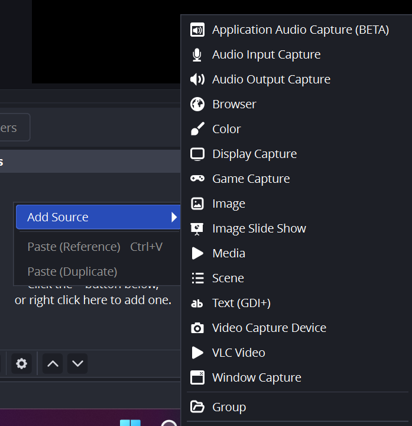
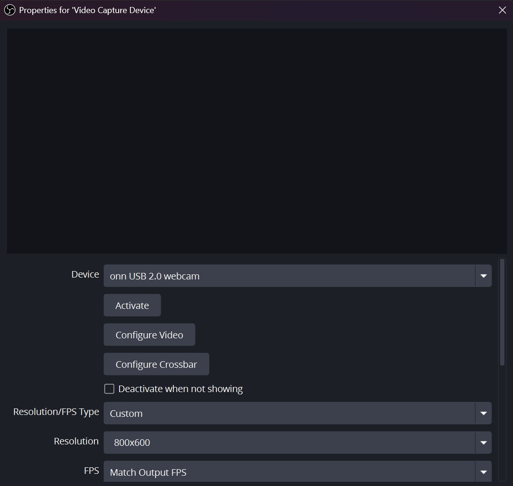
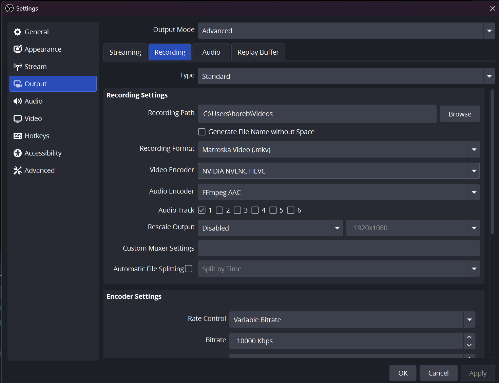
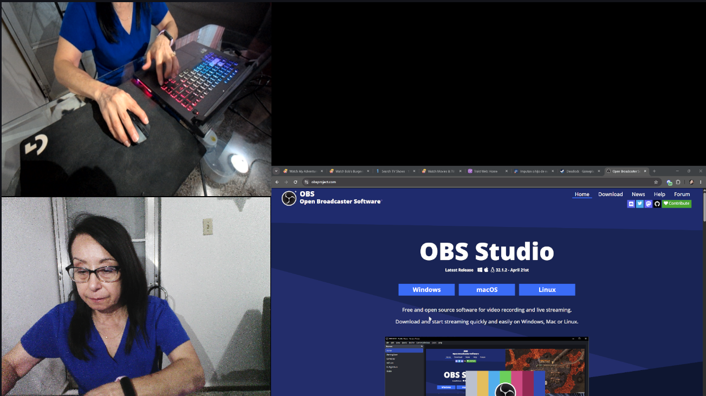
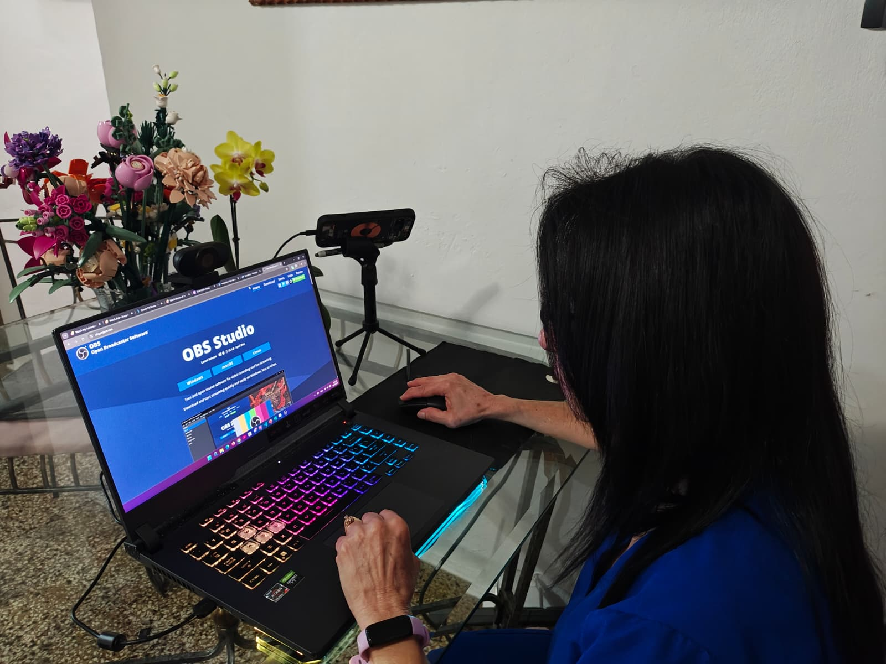

= Usability testing lab setup

:project: Cafeteria Ordering
:issue: 612
:assignee: @horebcotto21

In this document the specifics of hardware and software to be used in usability testing will described and instructions in how to setup and use them will be provided in order to guarantee that every test carried out is no different from another with the exception of the user that is taking the test. This standardization allows the comparison of test results that can provide valuable information in the usability of the teams project. 

Other specifics for what to test and steps users should take are not presented in this document, for information on carrying out usability tests refer to usability testing plans such as `LectureTopicTasks/ord-pay-usab-test-plan`, `usability-testing-limitations` and `usability-testing-LTT`. Just be aware that when a usability test is been carried the focus should of the tester(s) and testee(s) should be exclusively on the test, and the enviroment in which the test is being given should reflect this, minimizing distractions will be key to achieve this goal.

== Hardware

- Computer (MacOS, Windows 10/11, Linux)

- Camera (phone/webcam)

Ideally there should be a camera pointing at the face testee, a camera pointing at their hands using the device, be it a computer or a phone plus the screen recording/streaming. To achieve this, a specific software will be used, shown in the next section. 

== Software

- OBS Studio (Windows, MacOS, Linux)

OBS Studio is and Open source all in one streaming and/or recording software, available for most operating systems. OBS is mostly used to stream video sources live but it also has the capability of recording at the same time. It comes with a lot of features that normal pre-installed software for camera or sreen recording does not have, the downside is that it has a learning curve to use effectively. It can also be bolstered with plugins to do unique things, like showing key presses on screen or animating elements on screen. 

== Instructions

=== Installation

. Go to obsproject.com `Note:` OBS is also available in game and sofware distribution platform Steam this may ease installation and management

. Click the button for your computer's OS Windows, Linux, MacOs. This should download the installer.

. Run the installer and follow the instructions, you may choose a different directory if not a default directory will be used. 

== Configuration

. Sources - this section is where you can add video sources to the canvas.

. Canvas - a preview of how the screen is gonna look when streamin/recording.

. Controls - in this section you can start recording and access the settings screen.

. Audio Mixer - here you can adjust the volume from theh sources, by default desktop and mic audio is recorded. To avoid notification sounds from email, or messaging apps.  

=== Sources

-  Add *Video Capture Device* for webcam and/or phone camera connected to the computer that will record the interaction in the usability test.

* If the video source is a mobile phone addtitional configuration is needed.

* If using an iPhone, EpocCam or iVCam software is needed to be able to capture what the phone is looking at. 

* If using a newer Pixel phone and some other Android 15 or newer device you can use it as a webcam when connecting the device via USB to the computer.

- Add *Window Capture* source to record a specific window in the computer.

- Add *Display Capture* source to record entire screen of the computer.

=== Adding Source 

When adding a source a window will pop up showing configurations for device in the dropdown menu named Device you can see all the devices available to use. In this example the onn webcam is being added which will point to the user's face while executing the task we are measuring. 

When Window or Display capture sources are added the tester can choose which screen or program window to display in the canvas.  

=== Output Configuration

On the output screen you can select the directory, the file type and the encoder.

- The Directory to use is up to the tester.

- File type `.mp4` is recommended but it should be noted that `.mkv` files offer protection against unexpected interruptions in recording such as loosing power or storage is filled.

- Encoder is the way the video will be 'coded' and stored, traditionally H.264 is the most used but if HVEC is available in your computer it can offer a better quality (bitrate and resolution) video at a lower storage cost than H.264. `Note:` in a computer with a dedicated graphics processing unit the encoder for that brand should be used. `NVIDIA NVEC`, `AMD AVC/AMD HW` or `INTEL AV1` this will provide better performance and less hiccups in the recording if available, this translates to recording at higher resolutions and potentially higher frame rates but this is also limited to the hardware used `cameras, phones, etc`.

=== Canvas example

=== Setup Options 

- If tester only has a web cam either internally or third party and nothing else. It should point at the face of the testee so their reactions are captured when interacting with the project.

- If tester has more cameras/phones available to them they can add more sources and move and/or transform them to fit the canvas. Remember that more video feed means more processing power required an thus lower refresh rates or resolution for the cameras may be needed as well as lower frame rates, bitrate or resolution for the recording. 

== Example of setup in use

== References

- [1] OBS, Quick Start Guide. [Online]. https://obsproject.com/kb/quick-start-guide

- [2] OBS, Video Sources. [Online]. https://obsproject.com/kb/video-capture-sources

- [3] OBS, Display Capture Sources. [Online]. https://obsproject.com/kb/display-capture-sources 

- [4] Melvin Stanley, Transform Your iPhone into a Pro-Quality Webcam for OBS: A Step-by-Step Guide. [Online]. https://nexttools.net/how-to-use-iphone-as-webcam-for-obs/ 

- [5] Google, Use your Pixel phone as a webcam. [Online]. https://support.google.com/pixelcamera/answer/14274129?hl=en