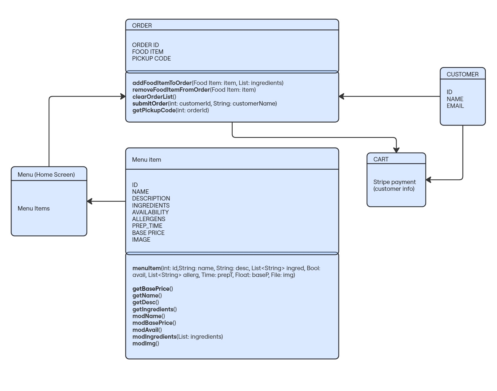
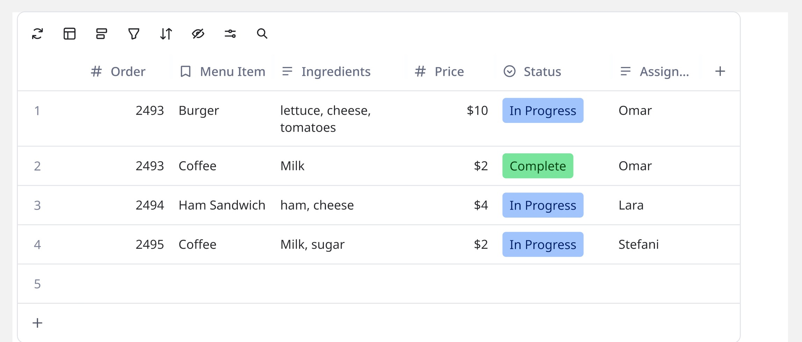

= Ordering System Structure

== Class Diagram
.Class Diagram of Odering System

=== Menu Item Class:
* A menu item object holds all information regarding a menu item.

* "menuItem" is the class constructor to create an object of the Menu item class
modification methods should only be used by staff members to change ingredients of menu item and not to modify order. Likely to be implemented by Staff operations team

=== Order Class
* Will hold n amount of menu items with the customer selected ingredients 
* Is in charge of temporarily hold items that will be displayed to customer on the payment screen and will be used to for the query to place order inside database when payment is confirmed successfull.

== Order class data structure

* A menu item cannot be modified directly as it will affect the displayed ingredient options in the menu. An order can consist of multiple menu items with different ingredient combinations. 
* That means that an order is a pair of _<Menu item,ingredients>_, since there is a high likelyhood of multiple ingredients they should be on a list.

The final structure would be a List that contains the _<Menu item, ingredients>_ pair, where ingredients are inside a list. 

**Breakdown:**

_List : Pairs_

_Pair : <Menu item, List: ingredients>_

**Finally:**

_List<Pair> : Pair: (Menu item,List<string>: ingredients)_

== Orders Table example
.Example when an order has more than one items

* When inserting order data into the database menu item and ingredients should have their respective columns
* To avoid conflicts between menu items in a single order, it is suggested to break the menu items into separate orders that share the same id.

