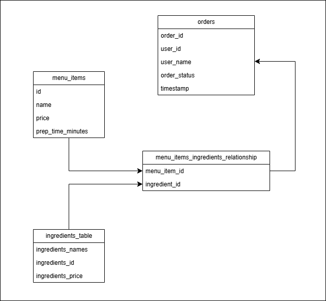
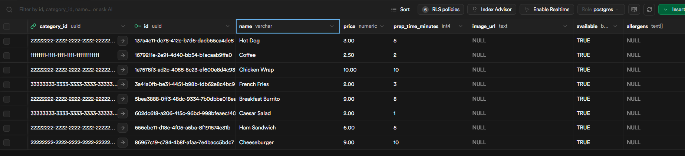
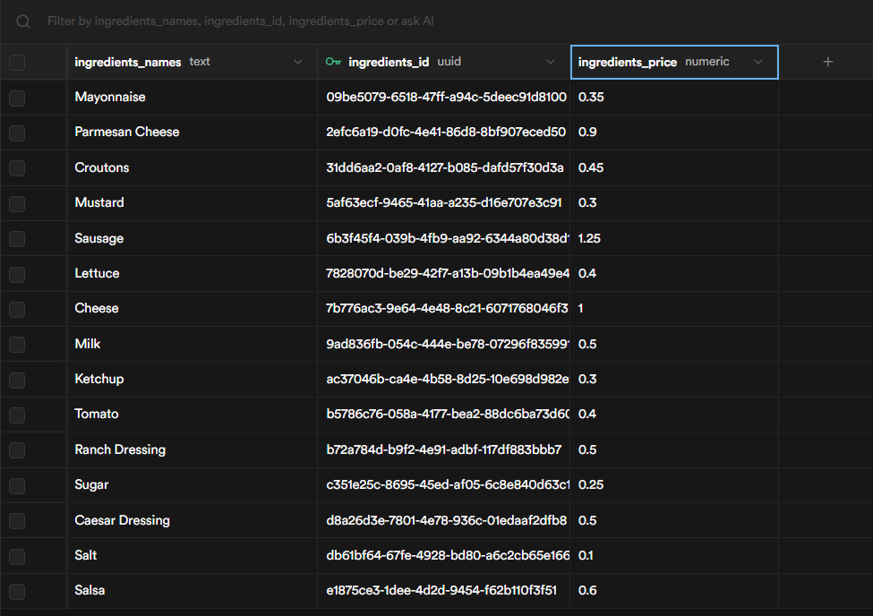
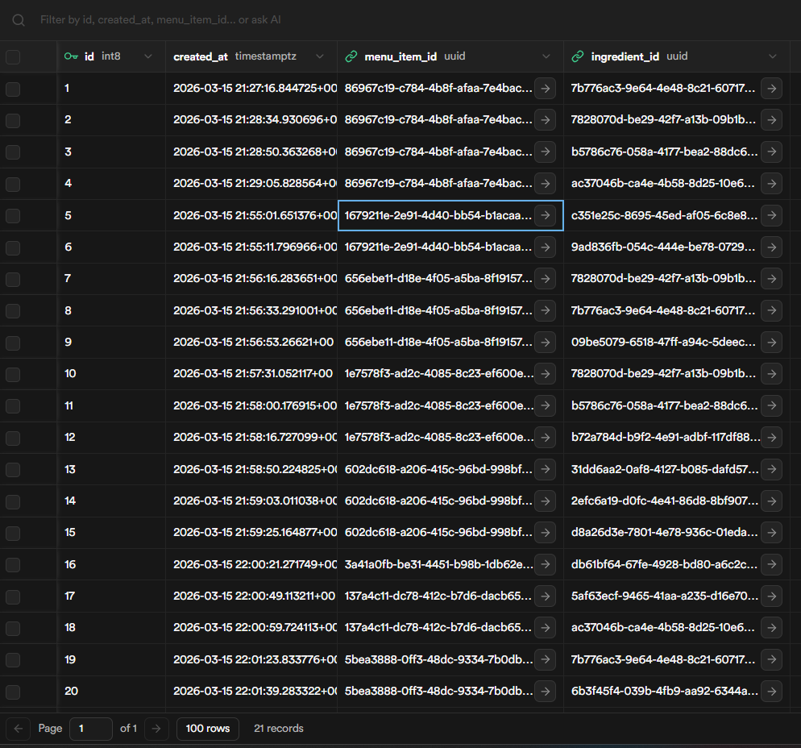
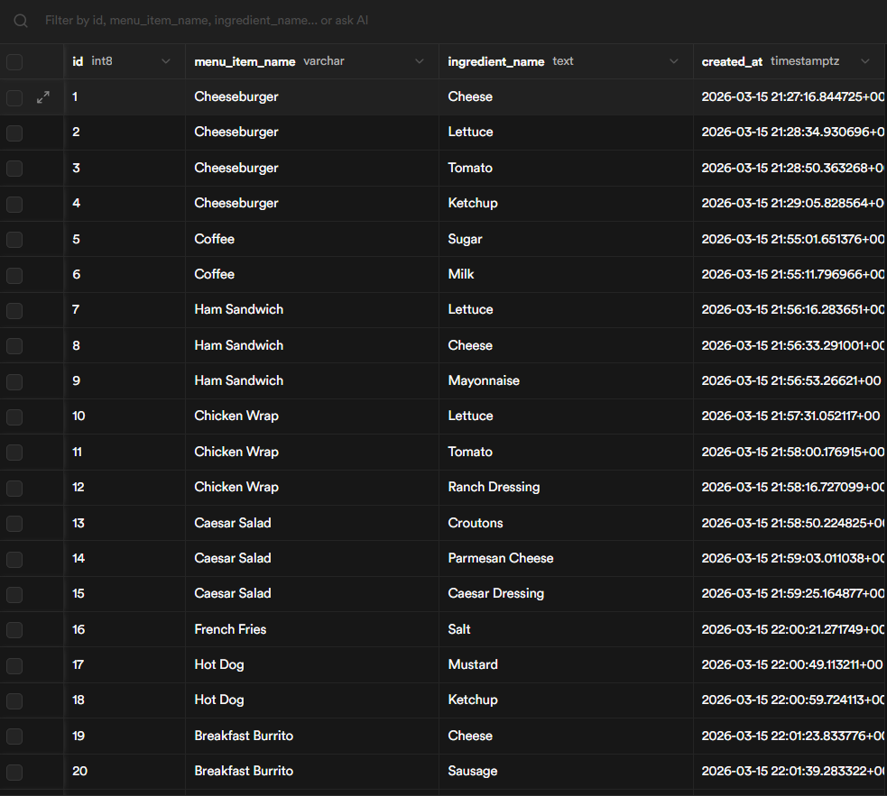
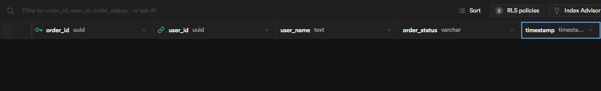

= Schema for Menu Items and Orders

== 1. Overview

This document explains the database schema for Menu Items and Orders created/modified to support the cafeteria ordering system.

This schema allows the system to:

* Store menu items available for purchase
* Store ingredients used in each menu item
* Maintain a many-to-many relationship between menu items and ingredients
* Store and track customer orders

The schema consists of four main tables:

* `menu_items`
* `ingredients_table`
* `menu_items_ingredients_relationship`
* `orders`

Key relationships:

* `menu_items` and `ingredients_table` have a many-to-many relationship
* `menu_items_ingredients_relationship` acts as a junction table for the previous relationship
* `orders` stores user order data

== 2. Schema Diagram

== 3. menu_items Table

=== Purpose

The `menu_items` table stores all the food items available on the menu. This table is part of the many-to-many relationship table (`menu_items_ingredients_relationship`) that allows the association of the menu items to the ingredients of the `ingredients_table` table. This table has the following modified columns: 

* `id`, this column represents the unique id for the menu item.
* `name`, this column represents the name for the menu item.
* `price`, this column represents the base price for the menu item.
* `prep_time_minutes`, this column represents the amount of time that takes for an order to prepare, in minutes.

A few examples for the menu items that are used in this table are the following:

* Coffee
* Ham Sandwich
* Cheeseburger
* Chicken Wrap
* Caesar Salad
* French Fries
* Hot Dog
* Breakfast Burrito

=== Table Structure

[cols="1,1,2"]
|===
|Column |Type |Description

|id
|UUID
|Unique identifier for each menu item

|name
|VARCHAR
|Name of the menu item

|price
|NUMERIC
|Price of the menu item

|prep_time_minutes
|INT4
|Time it takes for the preparation of each menu item

|===

=== Example Table View

  

== 4. ingredients_table Table

=== Purpose

The `ingredients_table` table stores all the ingredients associated to each menu item in the cafeteria ordering system. This table also part of the many-to-many relationship table (`menu_items_ingredients_relationship`) that connects the ingredients with their corresponding menu items stored in the `menu_items` table. These stored ingredients can be reused across multiple menu items. This design avoids redundancy and allows ingredients to be managed independently. This table has the following columns:

* `ingredients_names`, this column represents the name of the ingredient.
* `ingredients_id`, this column represents the unique identifier for each ingredient.
* `ingredients_price`, this column represents the individual price of the ingredient.

A few examples of the ingredients that are used in this table are the following:

* Sugar 
* Milk
* Lettuce
* Cheese 
* Mayonnaise
* Tomato 
* Ketchup
* Ranch Dressing
* Croutons 
* Parmesan Cheese 
* Caesar Dressing
* Salt
* Mustard
* Sausage
* Salsa

=== Table Structure

[cols="1,1,2"]
|===
|Column |Type |Description

|ingredients_names
|TEXT
|Name of the ingredient

|ingredients_id
|UUID
|Unique identifier for each ingredient

|ingredients_price
|NUMERIC
|Price of the ingredient

|===

=== Example Table View

== 5. menu_items_ingredients_relationship Table

=== Purpose

The `menu_items_ingredients_relationship` table represents the many-to-many relationship between the menu items of the `menu_items` table and the ingredients of the `ingredients_table`. This relationship was made to allow both previous tables to be connected without duplicating data, since a menu item can have multiple ingredients and a singular ingredient can be used in multiple menu items. This table has the following columns:

* `menu_item_id`, this column represents the unique identifier of the menu item that is being associated with an ingredient. This value references the `id` column from the `menu_items` table.

* `ingredient_id`, this column represents the unique identifier of the ingredient that is being associated with a menu item. This value references the `ingredients_id` column from the `ingredients_table` table.

A few examples of menu item and ingredient relationships stored in this table are the following:

[cols="1,1"]
|===
|Menu Item |Ingredient

|Coffee
|Sugar

|Coffee
|Milk

|Ham Sandwich
|Lettuce

|Ham Sandwich
|Cheese

|Ham Sandwich
|Mayonnaise

|Cheeseburger
|Cheese

|Cheeseburger
|Lettuce

|Cheeseburger
|Tomato

|Cheeseburger
|Ketchup

|Chicken Wrap
|Lettuce

|Chicken Wrap
|Tomato

|Chicken Wrap
|Ranch Dressing

|Caesar Salad
|Croutons

|Caesar Salad
|Parmesan Cheese

|Caesar Salad
|Caesar Dressing

|French Fries
|Salt

|Hot Dog
|Mustard

|Hot Dog
|Ketchup

|Breakfast Burrito
|Cheese

|Breakfast Burrito
|Sausage

|Breakfast Burrito
|Salsa
|===

=== Table Structure

[cols="1,1,2"]
|===
|Column |Type |Description

|menu_item_id
|UUID
|Identifier of the menu item that is associated with an ingredient

|ingredient_id
|UUID
|Identifier of the ingredient that is associated with a menu item

|===

=== Example Table View

References:

References with Visuals:

=== Foreign Keys

* `menu_item_id` → `menu_items.id`
* `ingredient_id` → `ingredients_table.ingredients_id`

== 6. orders Table

=== Purpose

The `orders` table stores the information related to the customer's order placed through the cafeteria ordering system. This table allows the system to keep track of who placed the order, the current status of the order, and the time at which the order was created. The order status can be updated as the order moves through different stages such as preparation and completion.

This table has the following columns:

* `order_id`, this column represents the unique identifier for each order.
* `user_id`, this column represents the identifier of the user who placed the order.
* `user_name`, this column represents the name of the customer placing the order.
* `order_status`, this column represents the current state of the order in the system.
* `timestamp`, this column represents the time when the order was placed.

A few examples of order statuses that may appear in this table are the following:

* placed
* confirmed
* preparing
* ready
* completed

=== Table Structure

[cols="1,1,2"]
|===
|Column |Type |Description

|order_id
|UUID
|Unique identifier for each order

|user_id
|UUID
|Identifier for the user placing the order

|user_name
|TEXT
|Name of the customer placing the order

|order_status
|VARCHAR
|Current status of the order (placed, confirmed, preparing, ready, completed)

|timestamp
|TIMESTAMP
|Time when the order was placed

|===

=== Example Table View

== 7. Relationship Summary

[cols="2,1"]
|===
|Relationship |Type

|menu_items → ingredients_table
|Many-to-Many

|menu_items → menu_items_ingredients_relationship
|One-to-Many

|ingredients_table → menu_items_ingredients_relationship
|One-to-Many
|===

The junction table `menu_items_ingredients_relationship` allows the system to properly implement the many-to-many relationship.

== 8. Conclusion

This schema enables the cafeteria ordering system to:

* Maintain a structured menu data without risks of duplicates
* Manage menu items and ingredients relationships
* Track customer orders

