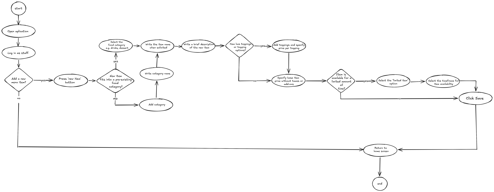

= Cafeteria Ordering System — Create new menu item (staff view) User Flowcharts
:toc:
:toclevels: 2

== Objective

== Legend
- Circles represent the start and end of a process.
- Ovals represent a process or action that needs to be taken.
- Diamonds represent a decision point.
- Arrows indicate the flow of the process from one step to the next.

== Add Menu Item Flowchart

== Primary Flow

=== 1. Authentication

1. User opens application.
2. User logs in as "Staff Member".
3. Staff member lands on Home Page.

=== 2. Create New Menu Item
1. Staff member navigates to "Add Menu Item" page.
2. Staff member fills out form with item details.
* Staff member check if item category already exists.
  ** If category does not exist, staff member creates new category.
* Staff member writes a brief description of the item, including any relevant information for customers.
* Staff member specifies toppings and modifiers for the item, if applicable.
* Staff member specifies if item is available for a limited time or if it is a regular menu item.
* Staff member specifies a price for the item.

=== 3. Submit New Menu Item
1. Staff member clicks "Submit" button.
2. System validates form input.
3. Staff member returns to Home Page.

