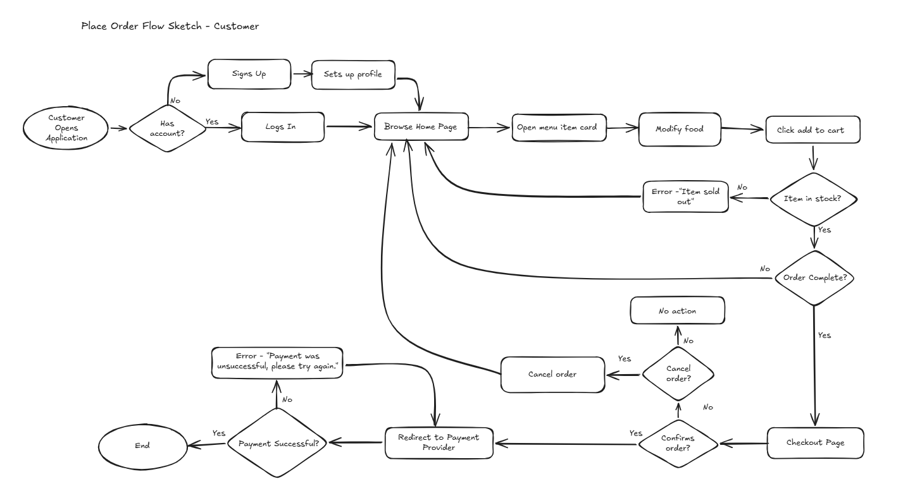
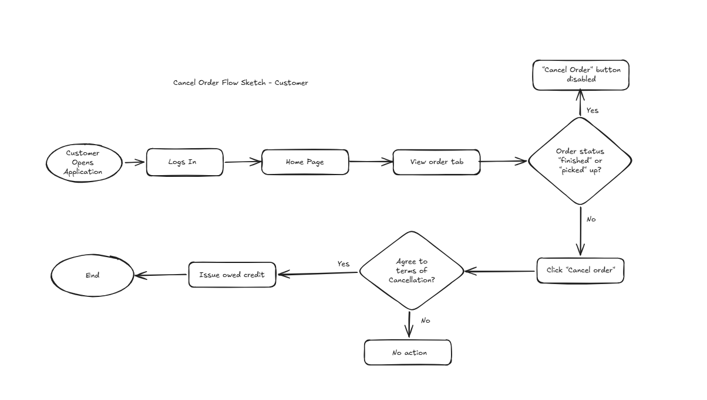

= Cafeteria Ordering System — Place and Cancel Order User Flowcharts
:toc:
:toclevels: 2

== Objective

Create a flowchart that demonstrates how a customer would move through the app to place, pay and then cancel an order.

== Legend

- Circles/Ovals represent the start and end of a process. 

- Rectangles represent a process or action that needs to be taken. 

- Diamonds represent a decision point. 

- Arrows indicate the flow of the process from one step to the next.

== Place Order Flowchart

== Primary Flow

=== 1. Authentication

1. Customer opens application.
2. System checks if customer has an account.
   * If no, Customer signs up and sets up profile.
   * If yes, Customer logs in.
3. Customer lands on Home Page.

=== 2. Browse and Add Item

1. Customer opens a menu item card.
2. Customer modifies item (if applicable).
3. Customer clicks "Add to cart".

==== Inventory Validation

* System checks if item is in stock.
  ** If not in stock, show error: "Item sold out".
  ** If in stock, item added to cart.

=== 3. Checkout

1. Customer navigates to Checkout Page.

=== 5. Cancellation During Checkout

* Customer may choose to cancel before confirming order.
  ** If cancelled, order is discarded.
  ** Refund process for cancellation starts.
  ** Process ends.

=== 4. Payment

1. System redirects customer to Payment Provider.
2. Payment Provider processes payment.

==== Payment Outcome

* If payment successful:
  ** Order is confirmed.
  ** Customer sees confirmation state.
* If payment fails:
  ** Show error: "Payment was unsuccessful, please try again."
  ** Customer may retry payment.

== Alternative Flows

=== A1 – Item Sold Out

* Trigger: Inventory check fails.
* Outcome: Error message displayed.
* Customer returns to browsing state.

=== A2 – Payment Failure

* Trigger: Payment provider returns failure.
* Outcome:
  ** Error message displayed.
  ** Customer may retry payment or abandon checkout.

== Cancel Order Flowchart

=== 1. Order Status Validation

System checks order status.

* If status = "Finished" or "Picked Up":
  ** Cancel button is disabled.
  ** No further action allowed.

* If status = "Unread" or "Started":
  ** Cancel button is enabled.
  ** Customer clicks "Cancel Order".

=== 2. Cancellation Confirmation

1. System displays Terms of Cancellation.
2. Customer must agree.

==== Decision

* If customer agrees:
  ** Order status updated to Cancelled.
  ** Owed credit issued (if applicable).
* If customer declines:
  ** No action taken.

== Refund / Credit Logic

* If payment was completed:
  ** Credit issued according to cancellation policy.
* If payment was not completed:
  ** Order simply invalidated.

