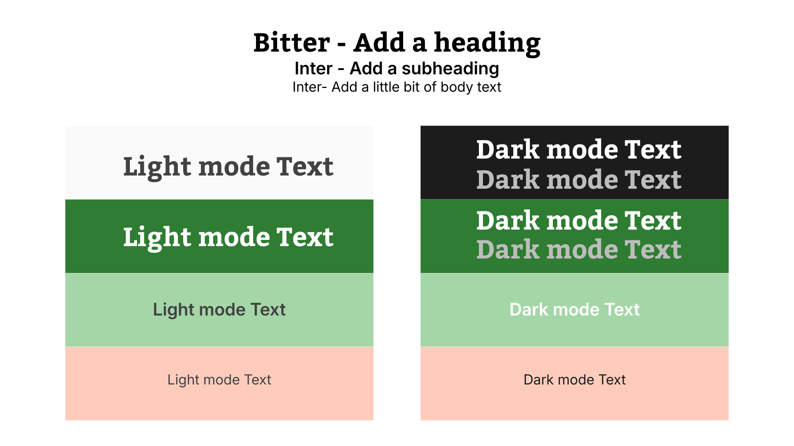

= Cafeteria Ordering System — Typography Guidelines
:toc:
:toclevels: 2

== Objective

Establish consistent typography guidelines for the Cafeteria Ordering System's project UI that complements the project's idea.

== Typography Guidelines

Typography Guidelines are a set of design rules that define how text appears across a user interface. It ensures consistency, readability, and reinforces the brand's identity. A solid guide should define:

- Font Type
- Font Size
- Font Color
- Font Style

Typography Guidelines should include a maximum of three fonts or typefaces that are separated in three categories:

- Headings
- Body text
- Buttons

== Font Type

To ensure the typography is consistent, visually appealing, and easy to read, the following font types are recommended for the Cafeteria Ordering System:

[cols="1,1", options="header"]
|===    
| Name | Usage
| Bitter | Headings
| Inter | Subheadings
| Inter | Body
| Inter | Buttons
|===

The font Inter is a versatile sans-serif typeface that that is suitable for body text and buttons due to its readability and modern appearance. It is very commonly used in applications.

The font Bitter is a serif typeface that was chosen taking the application's logo in mind. Additionally, it is easily readable and adds visual contrast while still maintaining simplicity.

**Note**: The font Bitter must be downloaded and imported into the project to be used for headings.

=== Font Size

To maintain a clear hierarchy and readability, the following font sizes are recommended for the Cafeteria Ordering System:

[cols="1,1,1", options="header"]
|===
| Element | Font Size | Example
| Heading | 32px | This is a Heading.
| SubHeading | 20px | This is a Subheading.
| Body Text | 16px | This is body text.
| Button Text | 16px | This is button text.
|===

Font sizes can be adjusted based on the specific design needs and screen sizes. However, proportional scaling  and uniformity should be maintained.

=== Font Style

Font styles will be applied in the form of varied weights (e.g., regular, bold) to create visual interest and hierarchy.

[cols="1,1,1", options="header"]
|===
| Element | Font Weight | Example
| Heading | Semibold | This is a Heading.
| SubHeading | Medium | This is a Subheading.
| Body Text | Regular | This is body text.
| Button Text | Medium | This is button text.
|===

=== Color 

In the document color-palette.adoc, the developer Ernesto Soto established that neutral colors and calm neutrals would work well with pastel accents and support light/dark modes. Taking his work as reference and making some necessary modifications, the following color palette guideline is recommended for typography in the Cafeteria Ordering System:

=== Light Mode

- Primary text: #424242 will be used for main content, headings, and important information. Cannot be used with #2E7D32 as background due to low contrast.
- Use #FAFAFA as text color when #2E7D32 is used as background to ensure readability and accessibility.

=== Dark Mode

- Use #FFFFFF for text against any of the background colors except #FFCCBC, where #1C1C1C should be used for better contrast and readability.
- Use #BDBDBD for secondary text against the dark background to maintain readability without overpowering the primary text. Do not use #BDBDBD for text against the backgrounds #A5D6A7 and #FFCCBC as it may not provide sufficient contrast. In those cases, use #1C1C1C for secondary text to ensure readability.

=== Visual Typography Example

