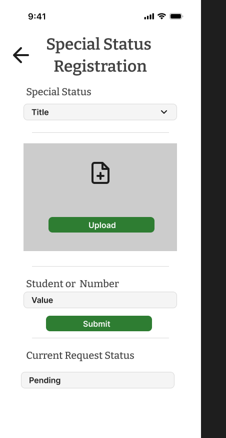

= Cafeteria Ordering System – Special Status Registration Design (Customer)
:toc:
:toclevels: 2

== Objective

The objective of this document is to provide an overview of the final UI design for the Special Status Registration page (Customer View). This includes a description of the layout structure and styled UI components.

== Page Overview

The Special Status Registration design presents a structured mobile form layout that allows customers to submit verification requests for special meal discounts.

The design follows the established typography and color guidelines of the Cafeteria Ordering System and maintains visual consistency with other finalized pages.

=== Design Preview

== UI Components

The final design includes the following styled elements:

- *Back Navigation Icon* – Returns the user to the previous page.
- *Page Title* – "Special Status Registration" styled using defined heading typography.
- *Status Selection Dropdown* – Allows selection of Employee / Athlete / Other.
- *Upload Section* – Highlighted container with upload icon and primary action button.
- *Student or Employee ID Input Field* – Styled text input for identification number.
- *Submit Button* – Primary action button styled using system color palette.
- *Current Request Status Display* – Status indicator showing request state (e.g., Pending).

== Layout Structure

The layout follows a vertical mobile structure composed of:

- Top navigation
- Page title
- Form section elements
- Primary action button
- Status display section

Spacing, alignment, typography, and colors follow the established branding and UI system guidelines.