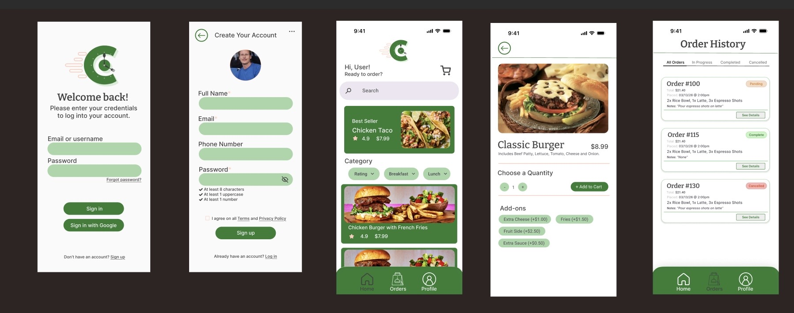
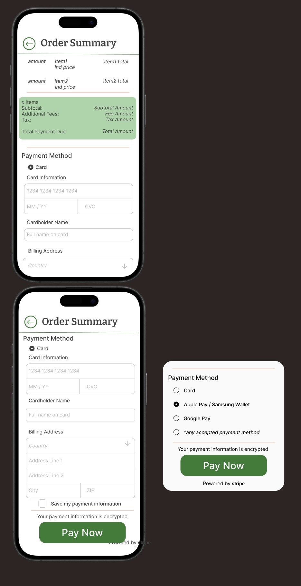
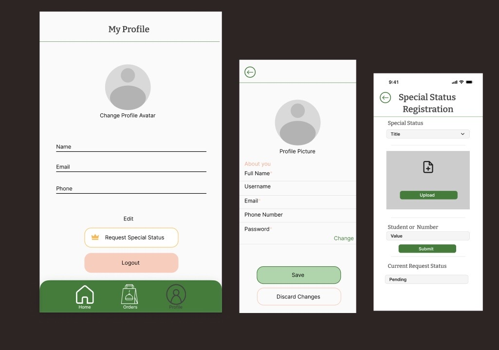
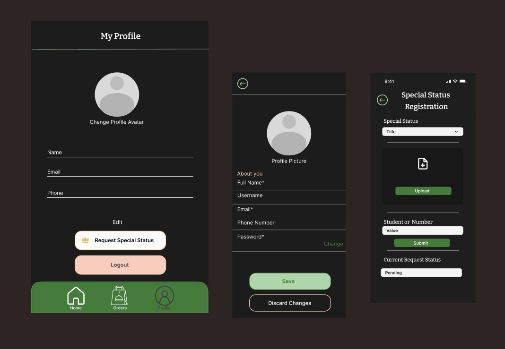
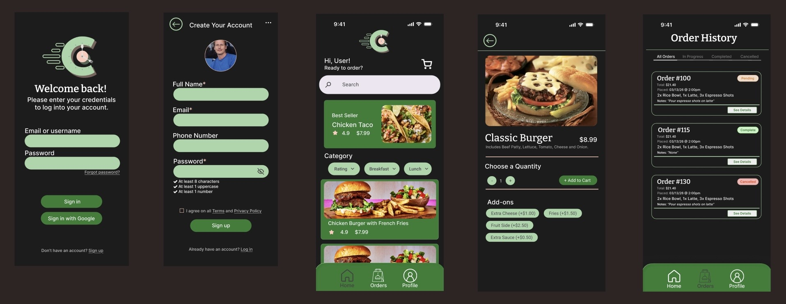
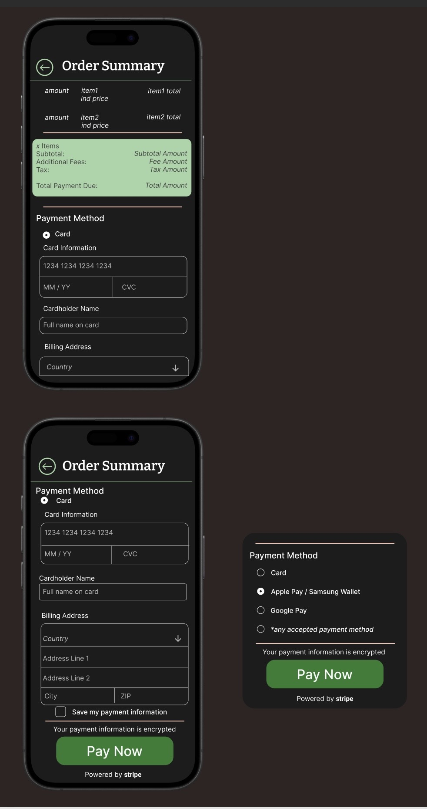
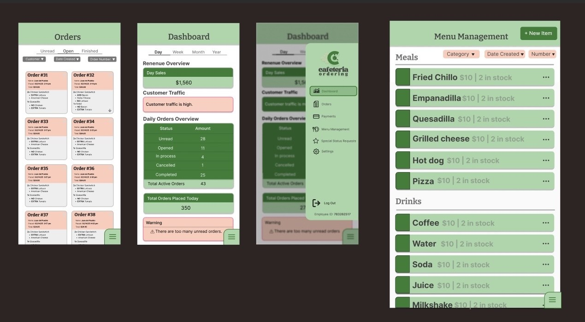
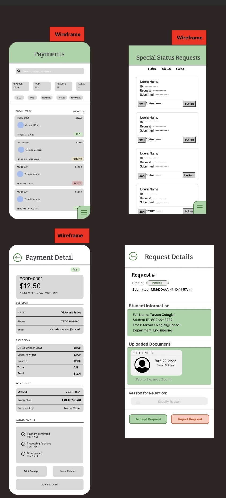
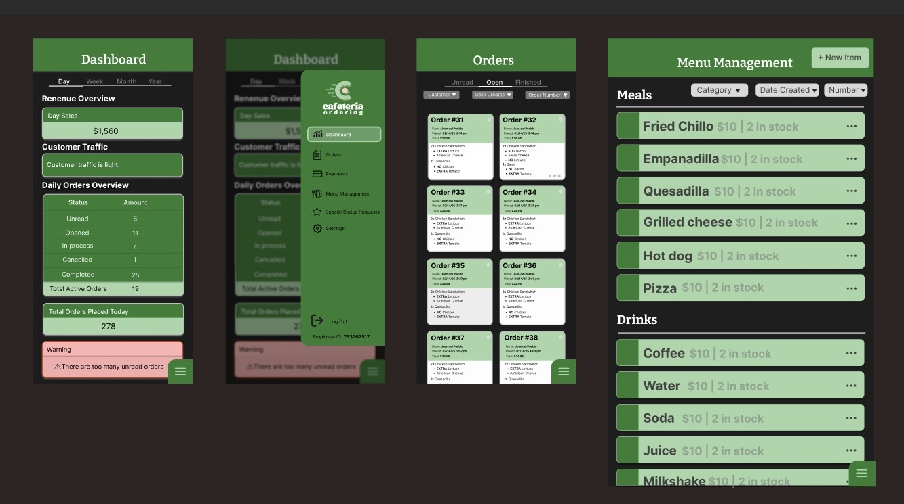
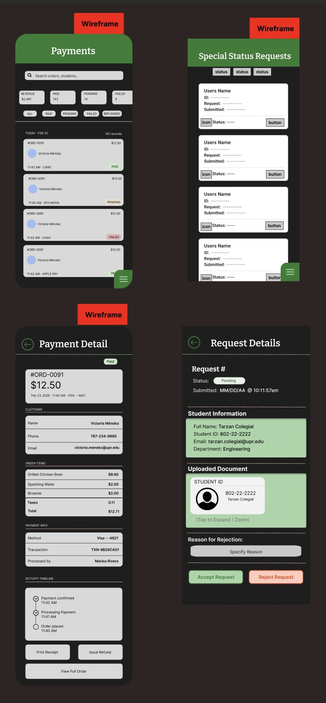

= Cafeteria Ordering System - Unite all Figma Designs

== Purpose:
Consolidate all separate UI designs made for the pages of the application into one Figma file. Ensure uniformity across all designs by making necessary adjustments.

== Final Product:
Final designs can be found in `documentation/designs/all_designs`. Additionally, the Figma file containing all the designs can be accessed at [Figma Link](https://www.figma.com/design/4nteHRlZEazPCpJxVgY8wX/Cafeteria-Ordering-UI?node-id=62-13&t=NmaxbMwjBCepA2It-1).

== Customer Designs:

=== Light Mode

=== Dark Mode

--
Overall design changes made:

- Changed arrow (back) icon so it was the same one on all screens that had it.
- Added navigation bar to all screens that had it, and changed icon colors to indicate if disabled.
- Added arrow (back) icon to all screens that had no direct connection to the navigation bar.
- Changed all screen headers to a more simplistic design.
- Removed the logo from most screens and only left it on the home screen. This way, screens that are not the home screen have more space for content and the logo is not repeated unnecessarily.
- Additional adjustments include making sure that font usage is uniform and changing the color scheme of some elements to match the overall design.

--

== Staff Designs:

=== Light Mode

=== Dark Mode

--
Overall design changes made:

- Changed arrow (back) icon so it was the same one on all screens that had it.
- Added arrow (back) icon to all screens that had no direct connection to the navigation bar.
- Modified navigation bar menu to contain logo.
- Changed screen headers for screens with no direct connection to the navigation bar to a more simplistic design.
- Removed the logo from all screens and added it to the navigation bar menu. This is a more visually appealing placement.
- Additional adjustments include making sure that font usage is uniform and changing the color scheme of some elements to match the overall design.

--