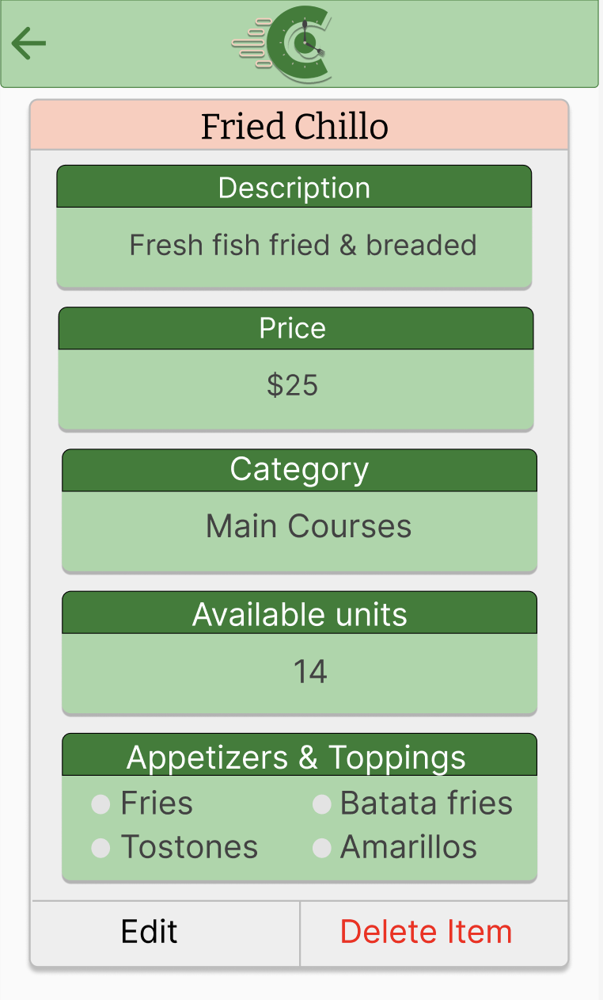
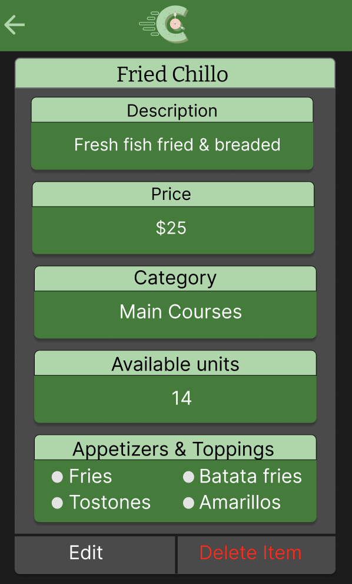

= Create Menu Details Screen Design

Author: @Nataliavera6
// Issue: #104

== Purpose:
Design displays fields for staff members to view and edit menu item details, including item name, description, price, and category. The design also includes options for staff members to add or remove toppings and modifiers for the menu item.

== Final product:
Final designs can be viewed in the `documentation/designs/menu_details_screen_design` folder. Designs were created for both light and dark mode, following the defined branding and typography guidelines.

[%unbreakable]
--
*Design description:*

- Designs were created for both light and dark mode.
- All elements were designed following the defined branding and typography guidelines.
- Users are able to view and edit menu item details, including item name, description, price, and category.
- Users are able to add or remove toppings and modifiers for the menu item.
- Users can delete the menu item if necessary.

.Light mode menu details page design.

.Dark mode menu details page design.

 