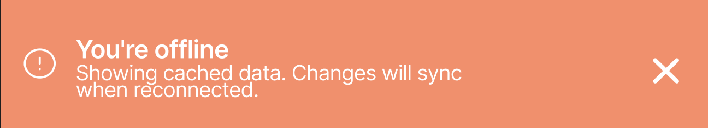
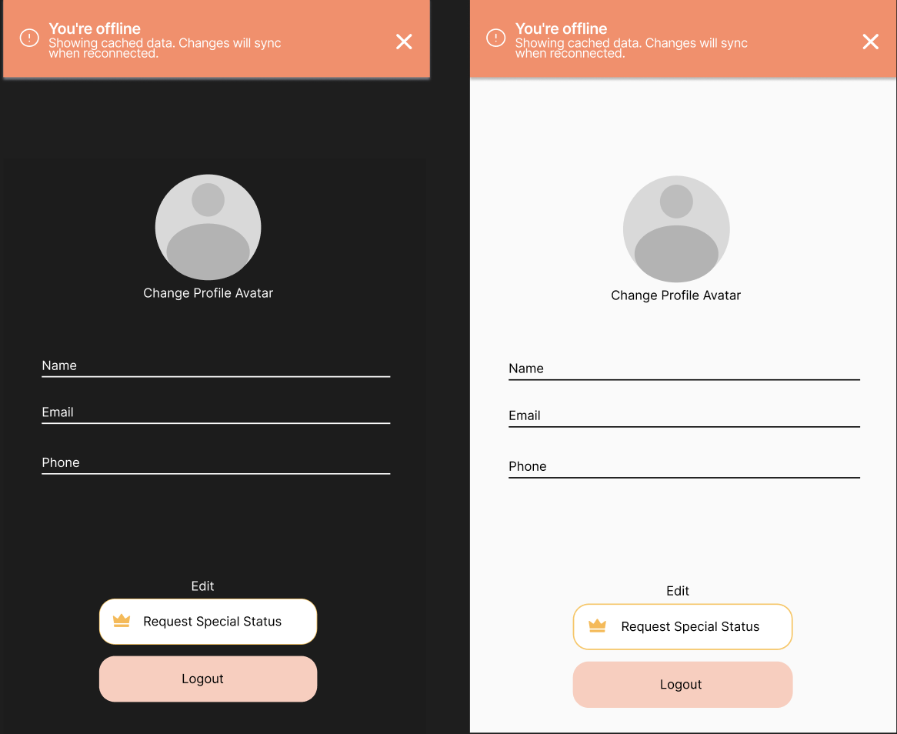
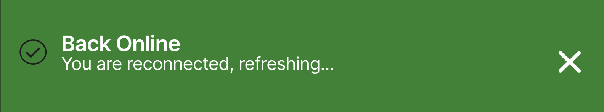
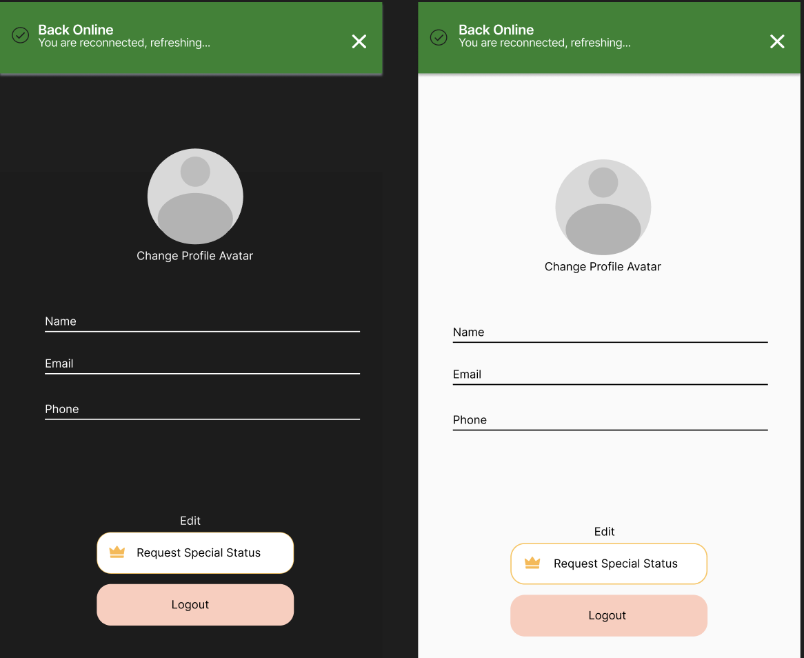

= Offline & Back Online Banner — Profile Page
Cafeteria Ordering App — UI Design Documentation
Profile & Offline Team
@daniellameleroo
:doctype: article
:toc: left
:toc-title: Table of Contents
:sectnums:
:icons: font

---

== Overview

This document describes the design process and mockup specifications for the *Offline* and *Back Online* banner indicators on the *Profile* page of the Cafeteria Ordering App. The banners communicate connection status to the user and ensure they are always aware when their profile data may be coming from local cache instead of live updates.

---

== Task context

As part of the offline mode indicators issue, the Profile page requires two distinct banner states:

* *Offline banner* — appears at the top of the Profile screen when internet connection is lost, informing the user that displayed data may be cached.
* *Back online banner* — replaces the offline banner when connection is restored, confirming that live data is being refreshed.

These banners must be non-intrusive, accessible, and consistent with the design system used across the app.

---

== Design process

=== Step 1 — Identify the placement

The banner is placed at the top of the Profile screen, directly below the navigation bar. This ensures:

* It is immediately visible without blocking profile content.
* It does not interfere with interactive elements like the edit button or profile photo.
* It follows the same placement pattern used on the Menu and Orders screens for consistency.

=== Step 2 — Define the two banner states

Two states were designed:

[cols="1,1,2", options="header"]
|===
| State
| Trigger
| What the user sees

| Offline
| Device loses internet connection
|  Dark Pink Banner with warning icon, "You are offline" message, and "Cached data" label

| Back online
| Device reconnects to internet
| Green banner with checkmark icon, "Back online" message, and "Refreshing..." label — auto-dismisses after 3 seconds
|===

=== Step 3 — Choose colors and tokens

Colors follow the existing design system and are chosen to communicate meaning without relying on color alone (accessibility requirement):

[cols="1,1,1", options="header"]
|===
| State
| Background
| Text

| Offline
| #FF8A65 
| #FAFAFA 

| Back online
| #27832C
| #FAFAFA 
|===

NOTE: Both banners pair an icon with text to meet WCAG AA accessibility standards. Color alone is never used as the only indicator.

=== Step 4 — Apply to the Profile screen

The banner sits between the navigation bar and the profile header section. The profile content below (name, avatar, order history, settings) remains fully visible and scrollable. The banner does not push content down — it overlays the top of the scroll area.

*Profile screen layout with offline banner:*

*Profile screen layout with back online banner:*

=== Step 5 — Define behavior and transitions

[cols="1,2", options="header"]
|===
| Behavior
| Specification

| Offline banner appears
| Immediately when connection is lost — no delay

| Offline banner dismisses
| Only when connection is restored

| Back online banner appears
| Immediately when connection is restored — replaces offline banner

| Back online banner dismisses
| Auto-dismisses after 3 seconds

| Profile data labels
| Switch from "Cached" to "Live" once data refreshes successfully

| Edit profile button
| Remains visible but shows a warning if user tries to save changes while offline
|===

---

== Acceptance criteria checklist

* [x] Offline banner designed and placed on Profile screen
* [x] Back online banner designed and placed on Profile screen
* [x] Both banners use icon + text (not color only)
* [x] Colors follow design system tokens
* [x] Banner auto-dismisses after 3 seconds on reconnect
* [x] Profile data labels switch from Cached to Live on reconnect
* [x] Design works on mobile layout (390px width)
* [x] Reviewed and approved by teammate
* [ ] Ready for handoff to developer

---

== Reference

* Offline Mode Indicators issue — `/docs/design/offline-indicators/`
* Cafeteria Ordering App design system
* WCAG AA accessibility guidelines — icon + text pairing requirement