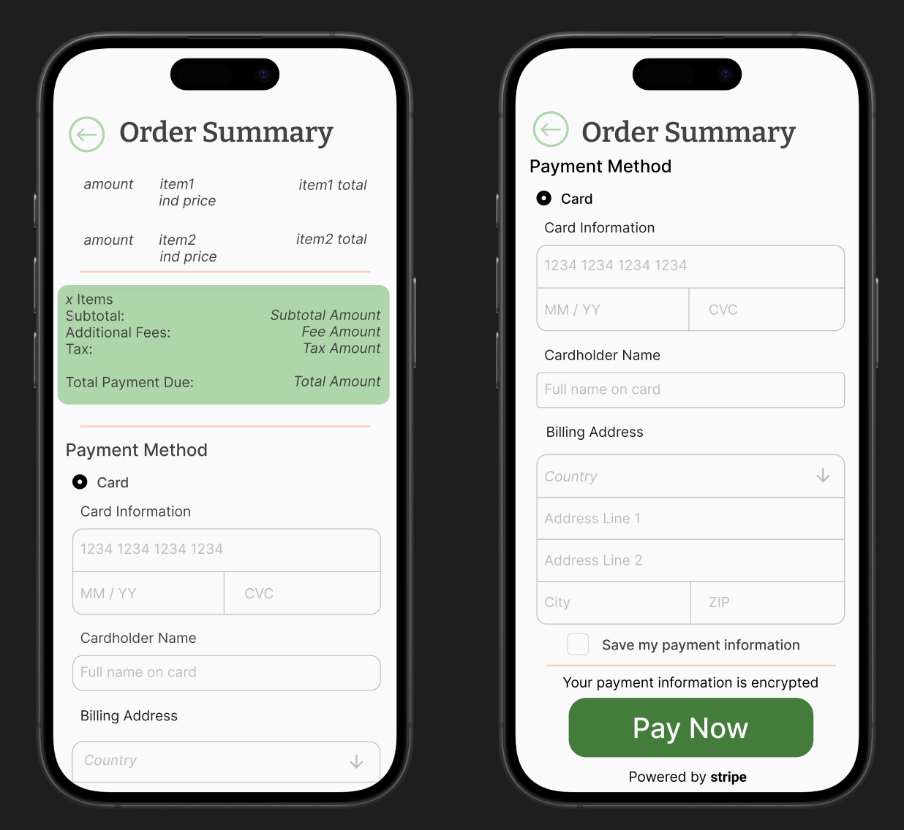
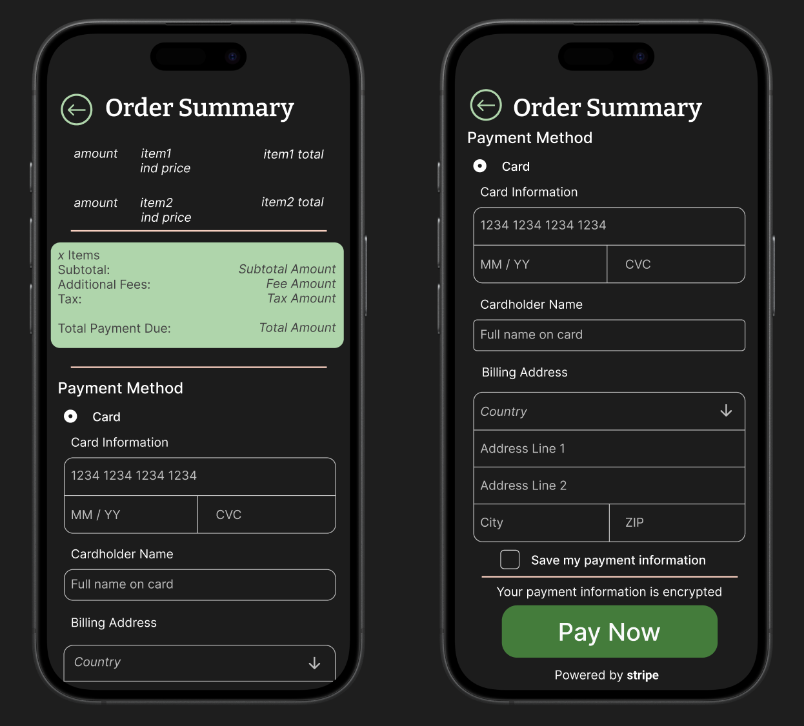
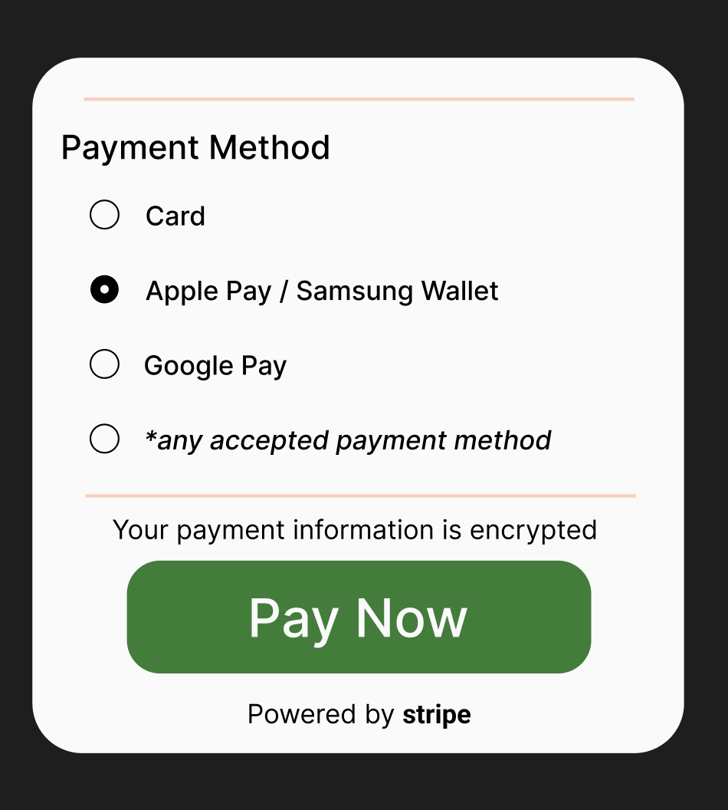
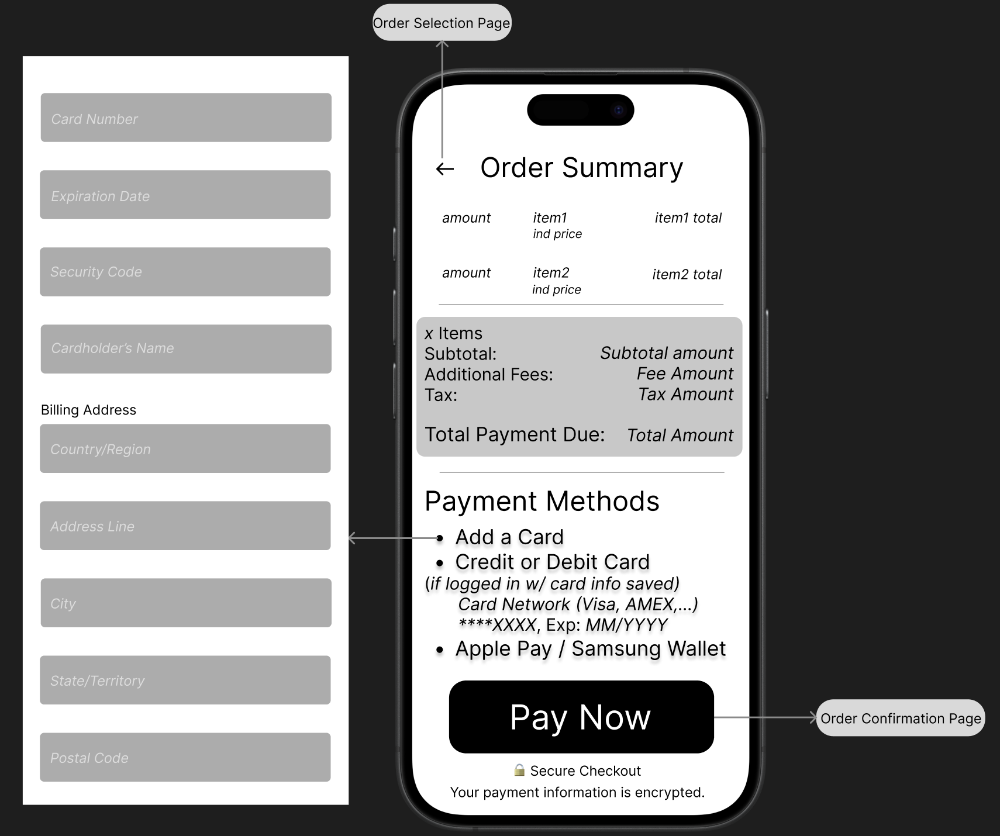

= Cafeteria Ordering System - Payment Page =
:toc:
:toclevels: 2

== Objective ==
Define the visual structure and layout of the Payment Page within the Cafeteria Ordering System mobile ordering flow. This document describes the finalized design components, including light mode, dark mode, and alternative payment method layouts.

== Design Overview ==
The Payment Page represents the final checkout screen where users review their order and proceed with payment.

This design includes:

- Light mode interface
- Dark mode interface
- Expanded payment method options layout
- Secure payment visual indicators
- Stripe integration reference

The purpose of this documentation is to:

- Establish layout structure
- Define section grouping
- Clarify visual hierarchy
- Document theme variations
- Serve as a reference for UI implementation

== Design Variants ==

=== 1. Light Mode ===

Includes:

- Light background (#FAFAFA) with dark text (#424242)
- Green-highlighted Order Summary total section (#A5D6A7)
- Clear section dividers (#FFCCBC)
- Input fields with light gray border and helper text (#BDBDBD)
- Prominent green "Pay Now" button (#2E7D32) with white text (#FAFAFA)
- "Powered by Stripe" indicator beneath primary action (#424242)

=== 2. Dark Mode ===

Includes:

- Dark background (#1C1C1C) with white text (#FFFFFF)
- Green-highlighted Order Summary total section (#A5D6A7)
- Clear section dividers (#FFCCBC)
- Input fields with light gray border and helper text (#BDBDBD)
- Consistent primary action styling
- "Powered by Stripe" indicator beneath primary action (#FFFFFF)

Both themes maintain identical layout structure and functionality.

=== 3. Additional Payment Methods Preview ===

A separate layout preview demonstrates how alternative payment methods are presented.

Includes:

- Radio button selection layout
- Card option
- Apple Pay / Samsung Wallet option
- Google Pay option
- Placeholder for additional accepted payment methods
- Primary "Pay Now" button
- Stripe branding indicator

== Layout Structure ==

The Payment Page is divided into the following primary sections:

=== 1. Return Button Section ===

Position:

- Top left of the screen

Includes:

- Navigation button to return to order modification

=== 2. Order Summary Section ===

Position:

- Upper portion of the screen

Includes:

- Item list with quantities
- Individual item pricing
- Calculated item totals
- Subtotal
- Additional fees
- Taxes
- Final total payment due

=== 3. Payment Method Section ===

Position:

- Below Order Summary

Includes:

- Payment method selection
- Card input fields (when Card is selected)
- Alternative payment method options
- Save payment information checkbox (optional)

=== 4. Payment Action Section ===

Position:

- Bottom of the screen

Includes:

- Secure payment visual cue
- Primary "Pay Now" button
- Stripe branding indicator

== Design File Reference ==

The designs are stored in:

documentation/designs/payment_page_design/payment_page_images/

Embedded References:

Light Mode Design:

Dark Mode Design:

Alternative Payment Methods Design:

== Wireframe File Reference ==

Wireframe Design:

== Acceptance Criteria ==

- Design reflects the structure defined in the approved Payment Page wireframe
- Approved color palette and typography is applied consistently across all components
- Order summary layout clearly displays quantity, item name, unit price, and total price
- Payment method section is visually organized and easy to distinguish
- Primary action button (“Pay Now”) is clearly emphasized
- Secure payment visual cue is included
- Light and dark mode designs are completed
- Stripe is visually represented as the selected payment processor in the design
- Ready for review
