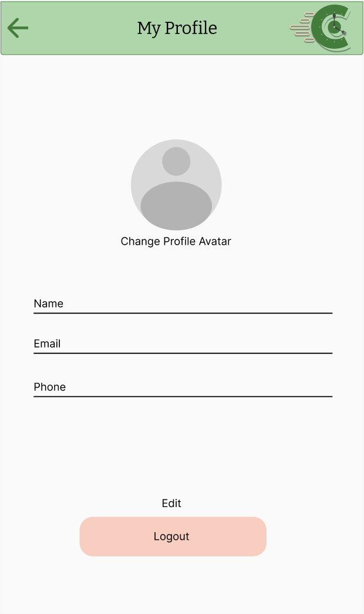
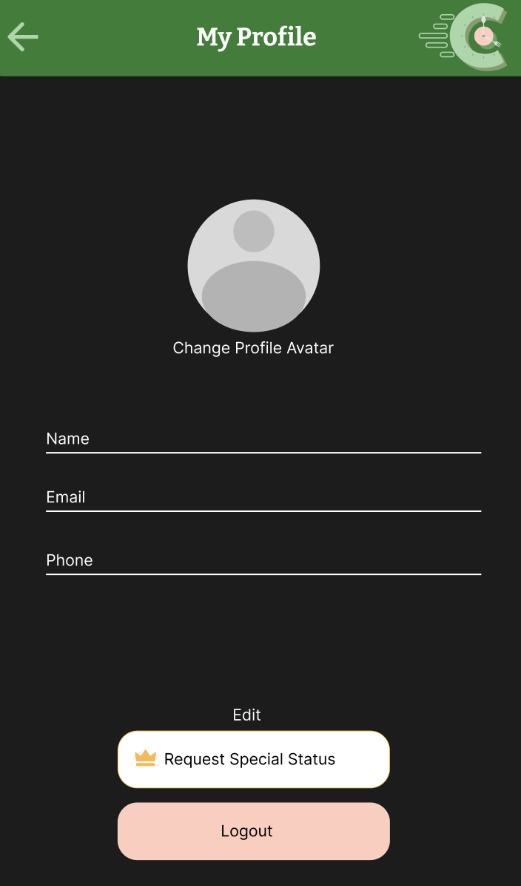

= Create Profile Design

Author: @Nataliavera6
// Issue: #105

== Purpose:
Design Profile Design for users to view their personal information, including: Name, phone number, and email. Buttons placed at the bottom of the page to edit information and log out.  (see `documentation/wireframes/profile_wireframe/profile_wireframe.png` for wireframe and `documentation/wireframes/profile_wireframe/profile-wireframe.adoc` for its corresponding documentation).

== Final product:
Final designs can be viewed in the `documentation/designs/profile_design/images` folder.

[%unbreakable]
--
*Design description:*

- Designs were created for both light and dark mode.
- All elements were designed following the defined branding and typography guidelines.
- Users can edit their personal information or log out by clicking the buttons at the bottom of the page.
- The profile picture is a placeholder and can be changed by the user.

- User can return to previous page by selecting the back button at the top left corner of the page.

.Light mode Profile page design.

.Dark mode Profile page design.

--
 