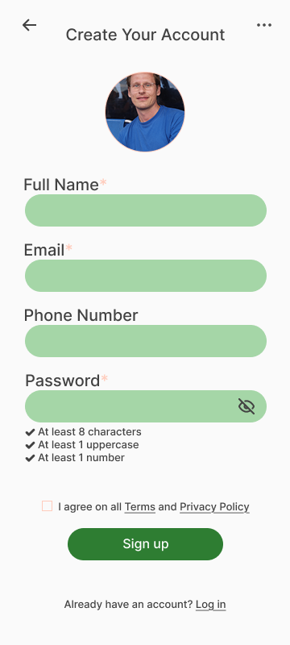
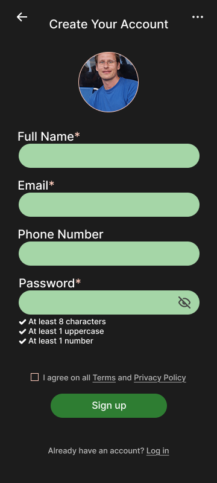
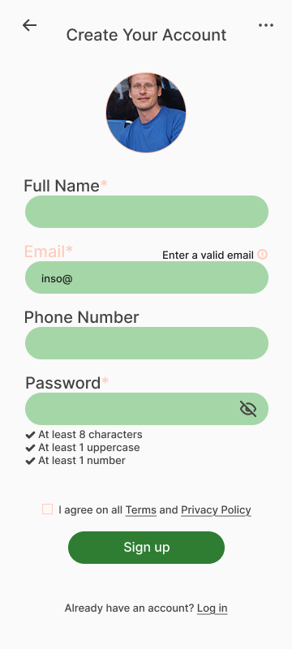
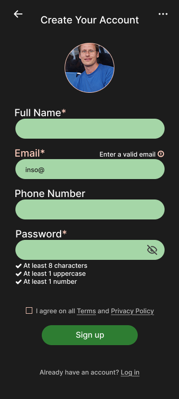
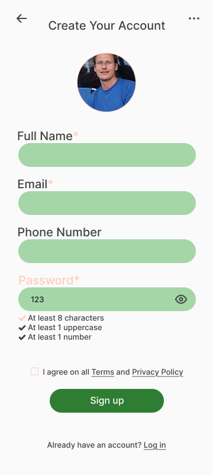
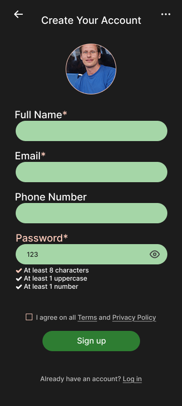

= Create Sign Up Design

Author: @FabiolaZTorres
// Issue: #133

== Purpose:
Design displays fields for users to enter their full name, email, phone number, and password, error handling for invalid emails and passwords, direct links to Terms, Privacy Policy, and Login pages, and a checkbox for accepting Terms and Privacy Policy. All this is done in accordance to the Sign Up wireframe (see `documentation\wireframes\sign-up_wireframe\` for wireframes and corresponding documentation.)

== Final product:
Final designs can be viewed in the `documentation/designs/signup_design/` folder.

[%unbreakable]
--
*Design description:*

- Designs were created for both light and dark mode.
- All elements were designed following the defined branding and typography guidelines.
- Users will enter their credentials into "Full Name", "Email", "Phone Number", and "Password" fields and then press the "Sign Up" button to submit this information and create their account.
- Users may upload a profile picture through the circle in the upper part of the screen.
- Users must accept Terms and Privacy Policy before creating their account.
- Emails and passwords must follow certain validity rules (e.g. passwords must have at least 8 characters).
- Password input field has visibility toggle and indicators for the validity rules met.
- Terms, Privacy Policy, and Log In links allow users to access those pages directly; the underlined letters represent said links.

.Light mode default/empty Sign Up page design.

.Dark mode default/empty Sign Up page design.

.Light mode invalid email error page design.

.Dark mode invalid email error page design.

.Light mode invalid password error page design.

.Dark mode invalid password error page design.

--
 

