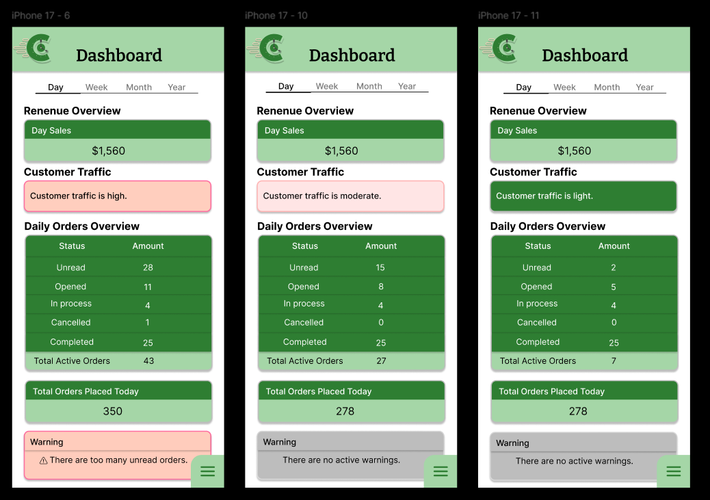
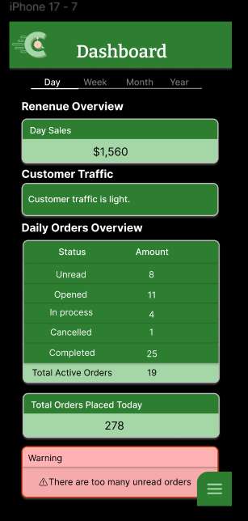
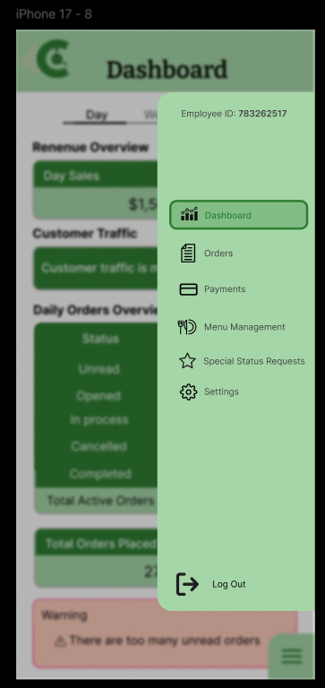
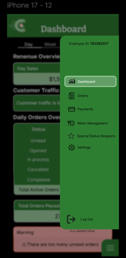

= Staff Dashboard Layout Design 

== Purpose:
This design shows the staff view page for the staff dashboard. The simple design ensures fast navigation and accessibility. 
Relevant images can be found in the `documentation/designs/staff_dashboard/images/` folder. 

Figma designs are located in: https://www.figma.com/design/Q3SPlMrqf7WuPmTfzGqt58/Staff-Dashboard-Page?node-id=0-1&t=AASyKgye8C6LMzoO-1

[%unbreakable]

---

*Design description and examples:*

.Staff Dashboard Design - Light Mode

*description:* The staff dashboard design includes easy visibility and accesibility for important metrics for the staff. These metrics include a breakdown of total orders split into each applicable status (unread, opened, In progress, cancelled and completed), as well as a breakdown of total sales for the day, week, month and year. The design is complemented by a traffic indicator that changes color and displays a message based on the number of orders being placed at the time. A warning label is displayed when the traffic indicator shows a high volume of orders or any imbalance between the different order statuses. 

In the bottom right, there is a button that allows staff to open the navigation bar.

.Staff Dashboard Design - Dark Mode

*description:* This design is the same as the light mode design, but with a dark color scheme.

.Staff Side Navigation Bar Design - Light Mode

*description:* The side navigation bar design includes the following options: Dashboard, Orders, Payments, Menu Management, Special Status Requests, Settings and Log Out. The side navigation bar is designed to be easily accessible and visible for staff members. It can be opened by clicking the button located at the bottom right of the dashboard page. Additionally, the employee's ID and name are displayed at the top of the navigation bar for accessibility.

.Staff Side Navigation Bar Design - Dark Mode

*description:* This design is the same as the light mode design, but with a dark color scheme.