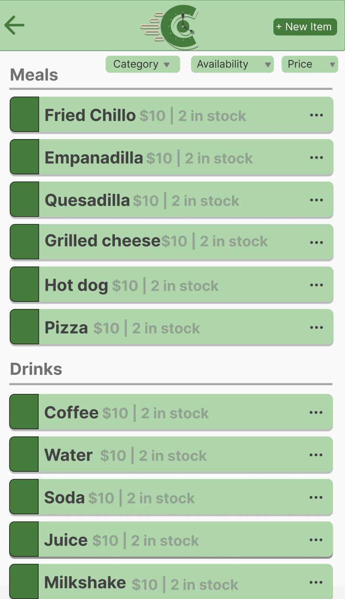
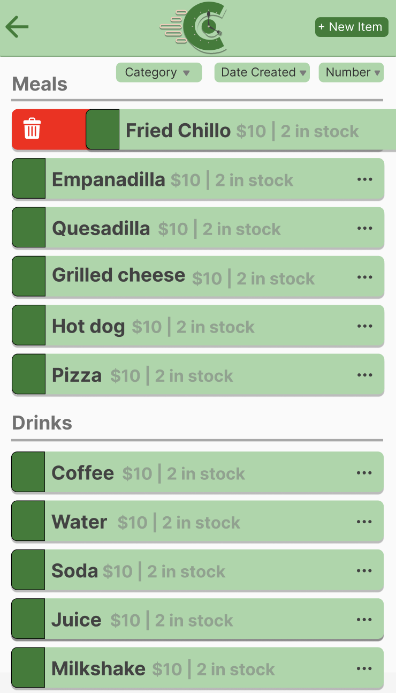
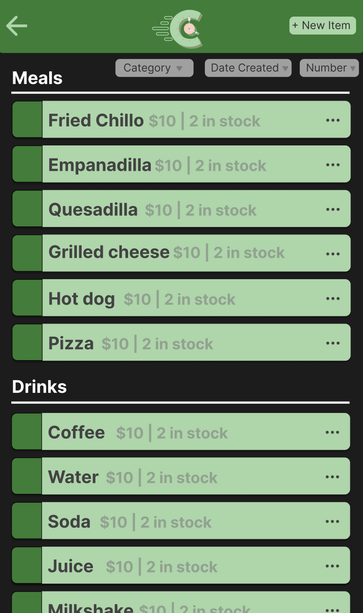
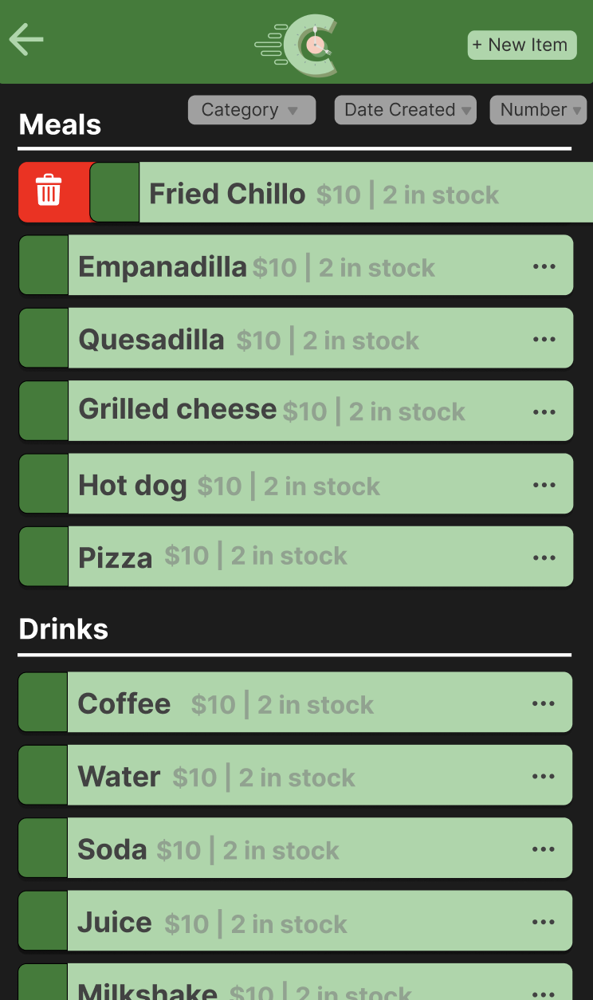

= Create Menu Items Screen Design

Author: @Nataliavera6
// Issue: #261

== Purpose:
Design displays all menu items for staff to view and delete if necessary. The design also includes options for staff members to add new menu items and edit existing ones.

== Final product:
Final designs can be viewed in the `documentation/designs/staff_menu_items_design/images` folder. Designs were created for both light and dark mode, following the defined branding and typography guidelines.

[%unbreakable]
--
*Design description:*

- Designs were created for both light and dark mode.
- All elements were designed following the defined branding and typography guidelines.
- Users are able to view and add menu items. 
- Users are able to access menu item details by clicking on the menu item card.
- Users can delete the menu item if necessary by swiping right on the menu item card.
- Users can filter items by category, availability and price by clicking on the filter button at the top right corner of the page.

.Light mode menu items page design.

.Light mode menu items page delete design.

.Dark mode menu items page design.

.Dark mode menu items page delete design.
