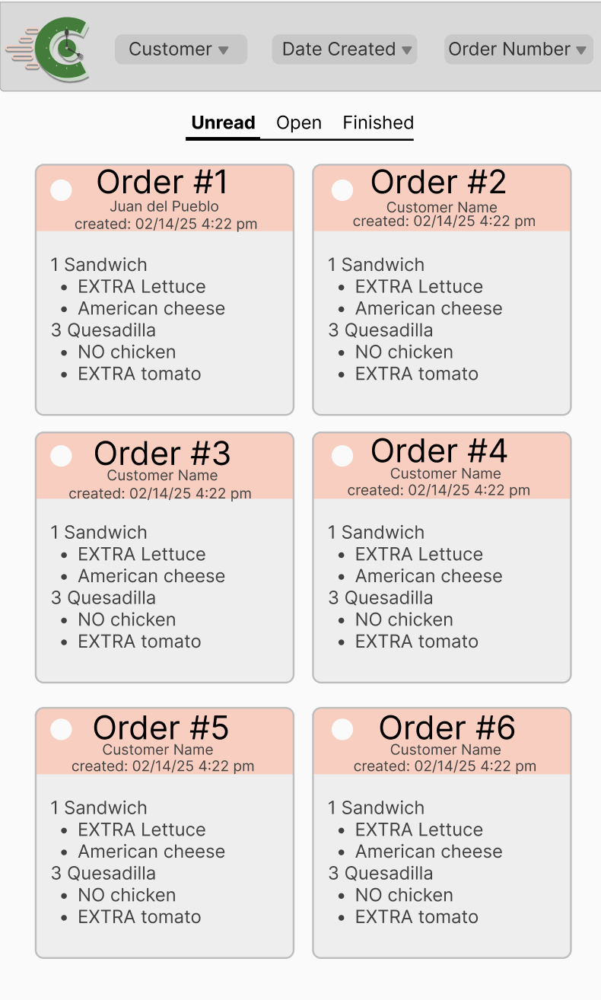
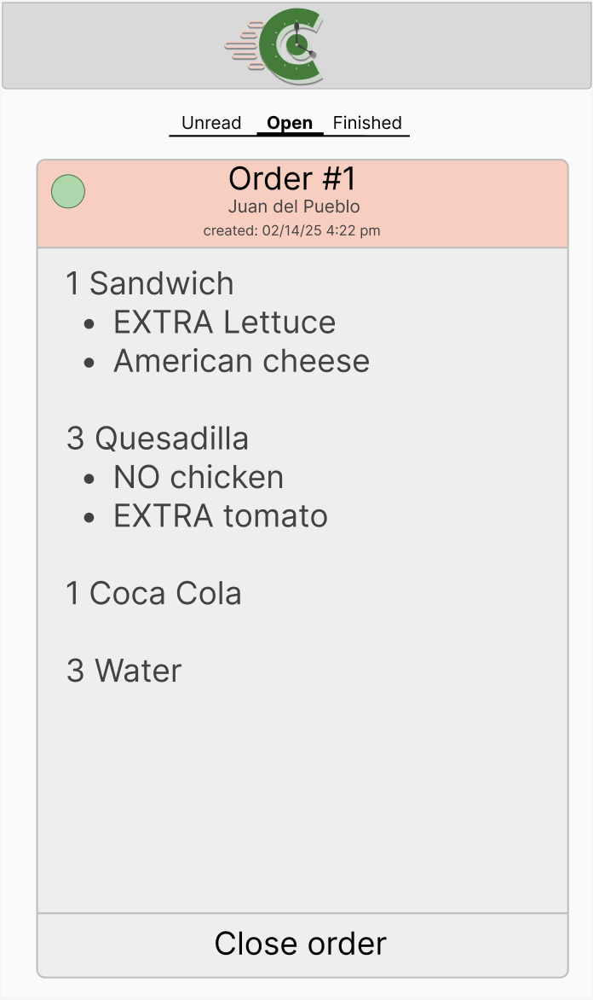
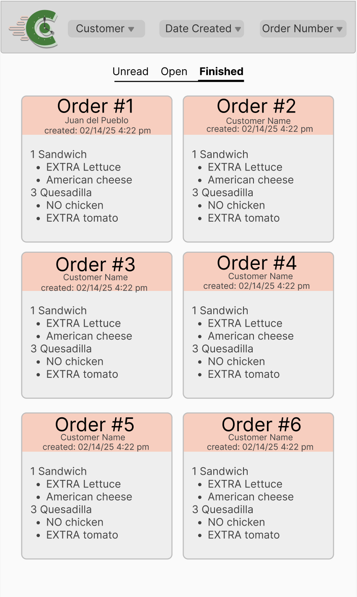
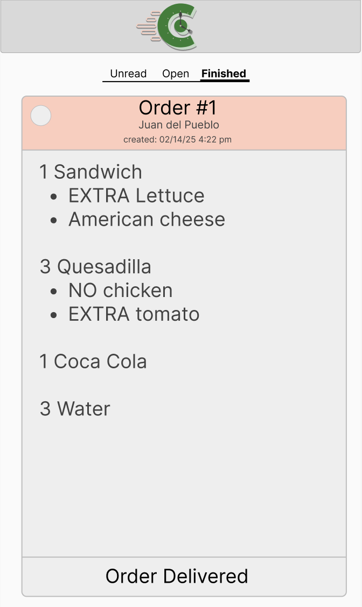

= Create View Order Design

Author: @Nataliavera6
// Issue: #103

== Purpose:
This design shows the staff view page for customer orders. The simple design ensures fast navigation and readibility. 
 (see `Wireframes/View Order Wireframe.pdf` for wireframe and `documentation/wireframes/view_order_wireframe/view_order.adoc` for its corresponding documentation).

== Final product:
Final designs can be viewed in the `documentation/designs/staff_view_order_design/` folder. Figma designs located in https://www.figma.com/design/KwEF9fKmdG9LXW8qrLvriL/Untitled?node-id=0-1&t=sdiHlsFeGnFNukOd-1

[%unbreakable]
--
*Design description:*

- Designs were created for unread, opened and finished orders.
- Each of these pages show expanded versions where staff can view the full order and change its status accordingly with the buttons placed at the bottom of the page.
- To avoid confusion, unread orders have a white dot at the corner, opened orders have a green dot at the corner and finished orders have no dot. 
- Once an order is marked as finished, the user will receive a notification that their order is ready for pick-up.

.Unopened orders page design.

.Unopened orders page design (expanded).
image::images/unread_order_expanded.png[Unopened orders page design (expanded), width=40%]
--
.Opened orders page design.
image::images/opened_orders_page.png[Opened orders page design,  width=40%]

.Opened orders page design (expanded).

--
.Finished orders page design.

.Finished orders page design (expanded).

--