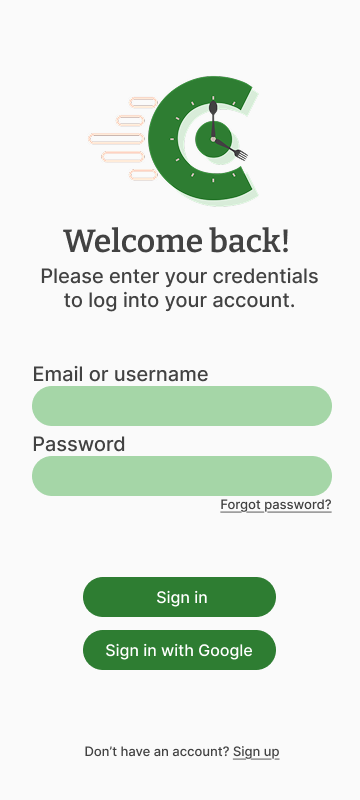
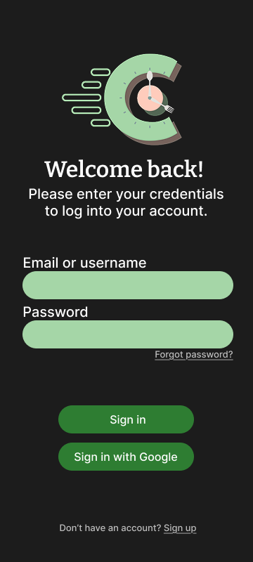
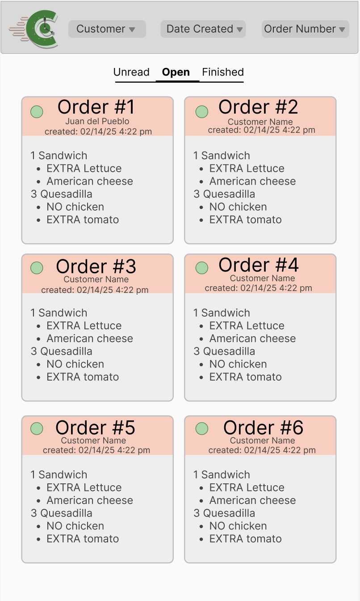
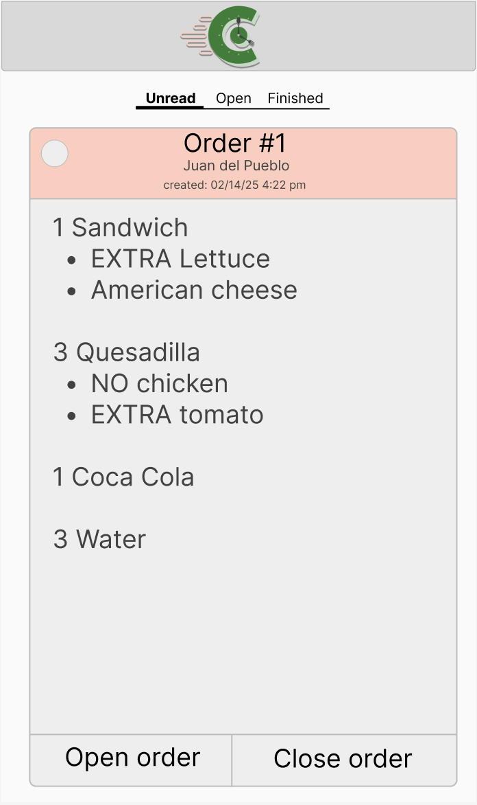
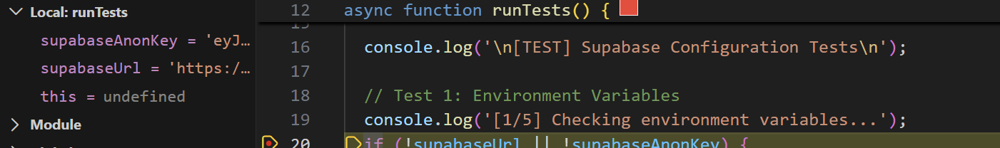
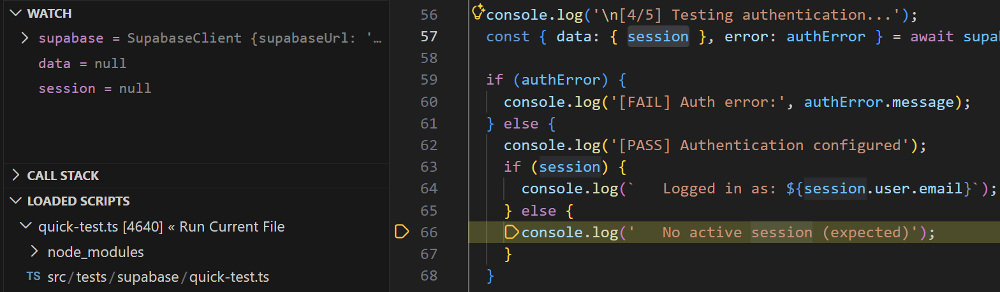
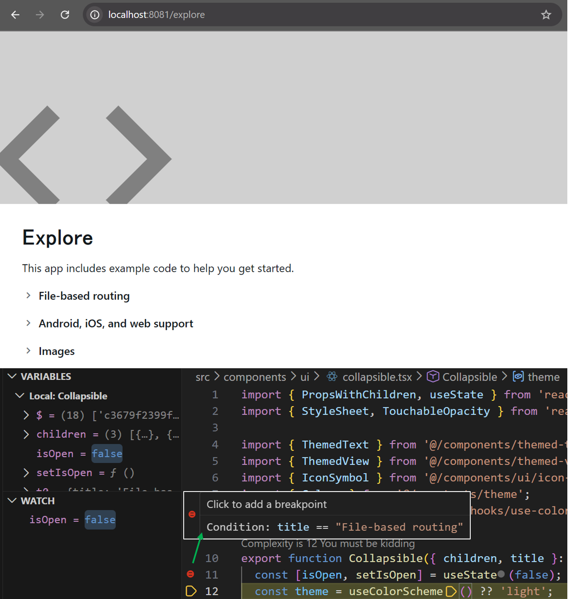

= Cafeteria Ordering System

== Informative Part

=== 1.1 Team

==== Team Structure

The project team is organized into four functional divisions: Documentation, Test Planning, Research and Set Up, and UI. Each division has a designated Team Lead responsible for coordinating tasks, tracking progress, and ensuring alignment with project requirements. All team members contribute collaboratively while focusing on their division's primary objectives.

==== Managers

The overall coordination of the project is led by:

* Alma D. Piñero-Calero
* Taimara P. Colon-Lopez

The managers oversee progress across all divisions, facilitate communication between teams, and ensure that project milestones and academic requirements are met.

==== Team Divisions

===== Documentation Team

*Objective:* +
Ensure that the project documentation satisfies all hand-in requirements and aligns with project scope.

*Responsibilities:*

* Maintain and update project documentation.
* Ensure clarity, structure, and completeness of required sections.
* Verify alignment between implementation and written documentation.
* Coordinate with other teams as needed.

*Team Lead:* Reinaldo J. Martinez-Morales

*Members:*

* Karina Lopez-Rodriguez
* Jahdiel E. Montero-Alicea
* Samarys Barreiro-Melendez
* Lorenzo A. Perez-Torres

===== Quality Assurance Team

*Objective:* +
Identify and implement the initial test suite and configure automated testing using GitHub Actions.

*Responsibilities:*

* Define testing strategies (unit, integration, etc.).
* Design test cases based on system requirements.
* Implement automated tests.
* Configure and maintain CI workflows using GitHub Actions.
* Monitor test coverage and reliability.

*Team Lead:* Jorge L. Deleon-Orama

*Members:*

* Horeb Cotto-Rosado
* Kevin J. Lara-Rodriguez
* Kian R. Ramos-Vega
* Lucas A. Matos-Datiz
* Januel E. Torres-Marquez
* Devlin Hahn-Acosta
* Gerardo Y. Soto-Rios
* Yadriel Rivera-Rodriguez
* Aryam Z. Diaz-Torres

===== Research and Set Up Team

*Objective:* +
Research and establish the technical foundation of the project, including mobile framework selection and backend/database configuration.

*Responsibilities:*

* Set up the initial project structure and development environment.
* Implement core functionality using React Native.
* Evaluate and select an appropriate database solution.
* Define backend requirements and integration approach.

*Team Lead:* Fernando Castro-Cancel

*Members:*

* Osvaldo F. Figueroa-Canino
* Yandre Caban-Torres
* Luis J. Cruz-Cruz
* Pedro J. Bonilla-Morales

===== UI Team

*Objective:* +
Define the application's branding, visual identity, and user experience.

*Responsibilities:*

* Design the application's interface and layout.
* Establish branding guidelines (colors, typography, design system).
* Define user workflows and navigation structure.
* Ensure usability and accessibility standards are considered.
* Collaborate with the development team to implement UI components.

*Team Lead:* Yamilette C. Alemany-Vazquez

*Members:*

* Daniella I. Melero-Pereira
* Andrea P. Segarra-Felix
* Fabiola Z. Torres-Maldonado
* Natalia S. Vera-Rivera
* Jon M. Vargas-Torres
* Kaysha L. Pagan-Lopez
* Ernesto S. Soto-Rivera

===== Partners

At this stage of the project, no external partners have been formally integrated. All current partners are internal team members and project managers who have direct responsibility in development and coordination. End users of the application are considered customers rather than partners.

If external partners become involved in later phases, their roles and responsibilities will be formally documented here.

=== 1.2 Current Situtation, needs, ideas

==== 1.2.1 Current Situation

Eating at the university cafeteria is a necessity for many students, yet the current environment at the cafeteria is incapable of adequately meeting its high demand. The university cafeteria consistently experiences long lines and heavy traffic, particularly during peak hours. This inefficiency creates a recurring dilemma where students must choose between securing a meal or arriving on time for their next academic commitment. When students are forced to skip meals due to these waiting times, it can result in a substantial negative impact on their overall health, mental focus, and academic performance. The primary cause of this issue is an outdated manual, in-person ordering system that is simply not capable of handling a high volume of students in a short time frame. Currently in the cafeteria, every order and payment transaction is processed manually at the counter, as there is no existing infrastructure for pre-ordering or remote payment. Consequently, the absence of a streamlined, digital alternative to the manual counter process remains a major hurdle to both student well-being and cafeteria operational efficiency.

==== 1.2.2 Needs

The long wait times at the university cafeteria show unmet needs in food service and campus life, not in any specific system or technology. These needs come from how student schedules, cafeteria operations, and institutional restrictions interact, and as a consequence, they affect many stakeholders.

===== Students

* Be able to access meals within limited time windows between classes without risking tardiness or absence.
* Reduce uncertainty around how long it will take to obtain food, especially during peak cafeteria hours.
* Maintain consistent access to meals that supports health, focus, and academic performance.
* Avoid having to choose between basic needs and academic responsibilities.

===== Cafeteria Staff

* Handle high volumes of orders efficiently without excessive pressure during peak periods.
* Maintain a smooth operational flow that minimizes crowding and confusion at service points.
* Receive clearer signals about when demand will come and the volume of orders. This will help better manage preparation.

===== University Staff

* Ensure campus services support student retention, wellness, and academic success.
* Minimize crowds in shared spaces to improve safety and traffic flow.
* Balance service improvements with resource and staffing constraints.

===== System-Wide Needs

* Reduced trouble between ordering, preparation, payment, and pickup.
* Alignment between student schedules and cafeteria service capacity.
* A food-service process that adapts to peak demand patterns.
* Meals can be obtained reliably and on time, even during busy periods.

===== Project Level Needs

* A clear statement of requirements based on stakeholder needs, without reference to any system. 
* A common language used in analysis, design, implementation, and testing to avoid confusion. 
* Planning documents (requirements, architecture, design, and test strategy) to support the solution selected later.
* A general description of cafeteria operations and how stakeholders interact. 

==== 1.2.3 Ideas

* Based on the previously discussed needs, a platform where students and staff from the university community can easily order food from the university cafeteria can drastically reduce the waiting time and facilitate staff work. The Cafeteria ordering application can help the aforementioned needs with features such as:

* Ordering: Now, it's easier than ever to order from the cafeteria! When a user wants to order an item, the available menu will be displayed with different sections depending on the type of food, sides, snacks and beverages. If an item from the menu is not available, it will not be able to be selected to order. After the user picks out what they want to order, they can choose whether to pay at the register or pay on the app, then, simply click order and done!

* Pick up times: The user can choose whether to schedule to pick up an order, or also, order instantly to be pick up as soon as possible.

*Notification system: The project will include notifications for both the user and the cafeteria staff to keep them informed about the status of an order, to improve communication and help coordinate order preparation and pickup.

* Order security: when the user wants to pick up an order in the designated pick-up station, the user will be given a code that they have to confirm with the staff to then be able to pick up their order, vastly reducing the possibility of having a customer's order stolen.

*Cafeteria mode: For the staff to monitor the orders, an “admin mode” will be integrated so that all the orders along with their pickup time will be displayed for the cafeteria staff, as well as notify them for order cancellations, any notes from the orders, etc. The staff will be able to input when an order is being processed, and when the order has been completed.

*Feedback: The app will ask the users for any feedback after an order has been processed and confirmed, this way, the team can make improvements and tweaks to the application and make the service better.

*The application can help students mantain an easier routine for their everyday life, cafeteria staff can be more organized and also cuts down on miscommunication when people have orders taken in person. 

=== 1.3 Scope, Span and Synopsis

==== 1.3.1 Scope and Span

==== 1.3.2 Synopsis

The Cafeteria Ordering System project addresses operational inefficiencies observed in the university cafeteria, particularly during peak service hours. Long waiting times, limited menu visibility, and uncertainty in demand create negative impacts on student well-being and cafeteria workflow. Rather than approaching this situation as a purely technical problem, the project follows a structured software engineering process grounded in domain understanding and systematic analysis.

The project begins with a detailed domain description that formalizes observed phenomena within the cafeteria environment. Through domain sketches, terminology definition, and concept analysis, the team establishes a shared vocabulary that reflects real-world entities, actions, events, and behaviors. This foundation ensures clarity and consistency in subsequent requirements engineering activities.

Building upon the domain model, stakeholder needs are translated into epics, user stories, and structured requirements. These include domain requirements, interface requirements, and machine requirements with measurable performance, availability, and capacity criteria. By defining explicit constraints and measurable targets, the project ensures that any proposed solution aligns with time-sensitive cafeteria operations and institutional limitations.

Early architectural reasoning is incorporated to anticipate system structure and interactions between core components such as ordering, payment processing, notification handling, and pickup coordination. Testing strategies, including Test-Driven Development (TDD) and Behavior-Driven Development (BDD), are integrated into the planned workflow to maintain traceability between requirements and implementation while enabling structured validation and verification.

Throughout the project, documentation, milestone planning, and coordinated team roles support alignment across analysis, design, testing, and implementation activities. By combining domain modeling, structured requirements engineering, architectural planning, and systematic testing preparation, the project establishes a comprehensive and well-founded approach to improving cafeteria service efficiency and reliability.

=== 1.4 Other Activities than just developing source code

Developing a software solution is only one part of this project. Though it may seem that way, the issues in the university cafeteria are not purely technical. They come from operational complexity, limited time between classes, and the interactions of stakeholders. Because of this, the project requires several supporting activities other than implementation to ensure that any future solution is effective and sustainable.

==== A key activity for this project is understanding and structuring the domain.

* Cafeteria operations during peak hours rely heavily on manual and informal processes, which makes it difficult to clearly understand how ordering, payment, preparation, and pickup relate to one another.
* Creating a domain description would help the team form a shared understanding of these workflows and constraints before moving toward any specific solution.

==== Another important activity is requirements engineering. Although the current situation reveals clear inefficiencies and frustration, there is no formal description of what an improved cafeteria experience should provide for its users.

* Defining requirements helps clarify expectations around functionality, performance, and usage from the perspective of students, staff, and administrators.
* Having explicit requirements ensures that later design and implementation decisions are guided by stakeholder needs rather than assumptions.

==== Early design and architectural reasoning are also necessary before any code is written.

* Because there is no existing digital infrastructure supporting peak-hour cafeteria operations, system structure and responsibilities cannot be taken from prior solutions. 
* Planning the system architecture and components early helps manage complexity and reduces the risk of poorly structured designs.

==== Planning for testing and evaluation is another essential activity.

* The cafeteria environment is highly time-sensitive, which makes reliability and usability especially important.
* Thinking ahead about how the system will be evaluated allows the team to measure improvements such as reduced waiting times and smoother order pickup once a solution is in place.

==== Finally, coordination and project organization tie all project activities together.

* Establishing milestones, documenting decisions, and assigning responsibilities helps keep the team aligned throughout the project.
* Maintaining communication with stakeholders supports scope management, progress tracking, and preparation for future iterations or expansion.

By combining domain understanding, requirements definition, design planning, testing preparation, and strong coordination with implementation, the project addresses both the technical and operational factors contributing to the current cafeteria situation.

=== 1.5 Derived Goals

In addition to the primary goal of reducing wait times and improving access to meals in the university cafeteria, the project also pursues several secondary but meaningful outcomes.

One derived goal is to contribute to improve student well-being beyond the immediate act of ordering food. By supporting more predictable access to meals, the project may contribute to promoting healthier daily routines, better time management, and reduced stress during peak academic hours. While the primary objective focuses on operational efficiency, this broader impact on student life represents an important secondary benefit.

Another goal is to support data-informed decision making within cafeteria operations. Even if not fully implemented in early stages, the structured collection of order and demand information creates the possibility for future analysis of peak times, popular menu items, and service bottlenecks. This can help cafeteria management optimize staffing, preparation strategies, and inventory planning over time.

The project also aims to encourage digital transformation within campus services. By introducing a structured, mobile-based ordering approach, the system may serve as a model for how other campus services might modernize their processes. This broader institutional impact extends beyond the cafeteria itself and contributes to a more technology-integrated campus environment.

A further derived goal is to strengthen collaboration and coordination among stakeholders. The structured interaction between students, cafeteria staff, and university administration fosters clearer communication channels and more transparent service processes. Even outside the application's technical implementation, this improved alignment between stakeholders is a valuable outcome.

At the project level, another secondary goal is to develop strong engineering practices within the team. Through domain analysis, requirements engineering, architectural planning, testing strategies, and documentation, the team builds experience in systematic software development. The artifacts produced during this process—such as requirement specifications, design descriptions, and test plans—form a reusable knowledge base for future academic or professional projects.

Finally, the project seeks to raise awareness about the importance of aligning campus services with student needs. By formally analyzing the current situation and articulating stakeholder needs, the project highlights the connection between operational systems and academic success. This reflective understanding of service design within the university context represents a broader outcome beyond the immediate functionality of the Cafeteria Ordering System.

== Descriptive Part

=== 2.1 Domain Description

==== 2.1.1 Domain Rough Sketch

The following snippets are raw records of observations and stakeholder experiences within the university cafeteria.

* The 10-Minute Dash: A student walks from the Engineering building toward the cafeteria at 12:05 PM. A small group arrives at the cafeteria at the same time to find a line that extends about 15 people toward the hallway. Some people looks at their watch and decide to walk to their next classroom. They are heard muttering that they'll just have to wait until 4:00 PM to eat.

* The Kitchen's Blind Spot: The kitchen staff members create multiple big trays which contain the "El colegial special" in the back of the kitchen. The team operates at high speed but maintains uncertainty about whether 10 or 100 students will enter the building within the next ten minutes will order. The staff members display visible pressure when 20 students enter the service area which becomes overlwhelming.

* The Post-Lunch Fatigue: Multiple students show signs of falling asleep during the 2:00 PM Biology lecture while they try to maintain their attention on the lesson. A student, when exiting the class, states that he skipped the meal because of the long line which may have caused him to miss his class. The student explained that his lack of food would affect his mental focus and academic performance throughout the day.

* The Payment Bottleneck: A student reaches the front of the line and is told that the payment system is down. The student waits for 3 minutes while the staff tries to fix the issue. Then, the student and every person behind him/her becomes visibly frustrated and expresses concern about being late for their next class.

* The uncertainty of the menu: A student stands at the back of the line, which has spilled out into the hallway near the exit of the cafeteria. From this distance, he cannot see the daily whiteboard or the steam table. He spends 5 minutes moving forward to only discover what the sides or prices are once they are two people away from the counter.

==== 2.1.2 Terminology

Student :: (entity, domain)
A person enrolled at the university attempting to obtain food from the cafeteria, typically within limited time windows between academic activities or responsibilities.

Cafeteria :: (entity, domain)
A food-service environment on campus where meals are prepared, ordered, paid for, and collected.

Cafeteria Staff :: (entity, domain)
Staff responsible for preparing meals, handling orders, processing payments, and managing the cafeteria.

Meal :: (entity, domain)
A prepared set of food items offered by the cafeteria during operating hours.

Menu :: (entity, domain)
A collection of meals and side options available during a specific period.

Order :: (entity, domain)
A request made by a student for one or more items from the menu.

Queue :: (entity, domain)
An ordered sequence of students waiting to place an order or complete payment.

Service Period :: (entity, domain)
A continuous time window during which the cafeteria is open and serving meals.

Order Placement :: (action, domain)
The act of selecting menu items and communicating the request to cafeteria staff.

Payment :: (action, domain)
The process of transferring money from a student to the cafeteria in exchange for a meal.

Meal Preparation :: (action, domain)
The productions of meals in advance or in response to incoming orders.

Meal Pickup :: (action, domain)
A student receiving a prepared meal after an order has been completed.

Waiting Time :: (attribute, domain)
The elapsed time between a student joining the queue and receiving their meal.

Student Has Just Joined the Queue :: (event, domain)
The moment a student enters the line to place an order.

Order Has Just Been Placed :: (event, domain)
The moment a student's order is communicated to cafeteria staff.

Payment Has Just Failed :: (event, domain)
The moment a payment attempt does not complete successfully, causing a delay in service.

Meal Has Just Been Prepared :: (event, domain)
The moment a meal becomes ready for pickup.

Student Has Just Left the Queue Without Ordering :: (event, domain)
The moment a student abandons the line due to time pressure or other circumstances.

Crowd Surge :: (behavior, domain)
A situation that occurs when large numbers of students arrive within a short time spans. This leads to long queues and increased service pressure.

Time-Constrained Decision Making :: (behavior, domain)
The moment students decide whether to wait for food based on current waiting time and proximity to their next class.

Uncertain Demand Preparation :: (behavior, domain)
A pattern where cafeteria staff prepare meals without precise knowledge of near-term demand volume.

Service Bottleneck :: (behavior, domain)
A recurring slowdown caused by limited capacity in ordering, payment, or preparation.

==== 2.1.3 Domain Terminology in Relation to Domain Rough Sketch

This section relates the defined domain terminology (Section 2.1.2) to specific observations documented in the domain rough sketch (Section 2.1.1). The terminology presented here represents processed and abstracted concepts derived from real-world domain phenomena observed in stakeholder experiences and operational conditions.

The rough sketch provides raw observations of behaviors, constraints, and interactions within the cafeteria environment. Through analysis, these observations were abstracted into formal domain concepts, entities, actions, events, attributes, and behaviors.

The following relationships illustrate how domain terminology originates from observed domain phenomena:

* Queue, Waiting Time, and Student Has Just Joined the Queue  
- Derived from *The 10-Minute Dash*, where students encounter a line extending approximately 15 people into the hallway. This observation demonstrates the existence of an ordered sequence of students waiting for service (Queue), measurable delays between joining and receiving service (Waiting Time), and the identifiable moment when a student enters the queue (Student Has Just Joined the Queue).

* Student Has Just Left the Queue Without Ordering and Time-Constrained Decision Making  
- Derived from *The 10-Minute Dash* and *The Post-Lunch Fatigue*, where students decide to leave the line due to insufficient available time before their next academic commitment. These observations reveal that students evaluate waiting time against external time constraints, resulting in the observable event of abandoning the queue.

* Meal, Meal Preparation, and Batch Preparation Under Unpredictable Circumstances  
- Derived from *The Kitchen's Blind Spot*, where cafeteria staff prepare multiple trays of meals without precise knowledge of how many students will arrive. This demonstrates the existence of prepared food units (Meal), the act of producing those meals (Meal Preparation), and the behavior of preparing food under demand uncertainty (Batch Preparation Under Unpredictable Circumstances).

* Crowd Surge and Service Bottleneck  
- Derived from *The Kitchen's Blind Spot* and *The Payment Bottleneck*, where sudden increases in arriving students create operational pressure and service delays. These observations establish the behavior of rapid increases in student arrival (Crowd Surge) and the resulting slowdown in service processes (Service Bottleneck).

* Order, Order Placement, and Order Has Just Been Placed  
- Derived implicitly from all rough sketch scenarios involving students progressing through the cafeteria service process. These observations demonstrate that students communicate requests for meals, resulting in identifiable moments when requests are formally made.

* Payment and Payment Has Just Failed  
- Derived from *The Payment Bottleneck*, where the payment system becomes unavailable, preventing students from completing transactions. This observation demonstrates the existence of a monetary exchange process (Payment) and identifiable failure events within that process (Payment Has Just Failed).

* Menu and Menu Visibility Constraints  
- Derived from *The Uncertainty of the Menu*, where students are unable to see available meal options or prices until reaching the front of the queue. This establishes the existence of a defined set of available meal options (Menu) and the dependency of student decision-making on access to this information.

* Meal Pickup and Meal Has Just Been Prepared  
- Derived from the implicit service flow observed across all rough sketch scenarios, where meals are prepared and subsequently transferred to students. This establishes the existence of a distinct moment when a meal becomes available (Meal Has Just Been Prepared) and the act of receiving that meal (Meal Pickup).

* Cafeteria Staff and Operational Pressure Under Demand Variability  
- Derived from *The Kitchen's Blind Spot* and *The Payment Bottleneck*, where staff members prepare meals and respond to sudden increases in student arrivals and operational disruptions. These observations establish cafeteria staff as active domain entities responsible for food preparation and service execution.

These relationships demonstrate that the terminology defined in Section 2.1.2 is not arbitrary, but rather the result of systematic abstraction and formalization of domain phenomena observed in the rough sketch. This ensures that the terminology accurately reflects the domain environment and provides a reliable conceptual foundation for subsequent domain modeling and requirements analysis.

==== 2.1.4 Narrative

The university's cafeteria functions as one of the primary food services that support the daily nutritional needs of students, staff, and faculty. Often individuals depend on the cafeteria to receive their prepared meals under tight schedules that are most likely caused by multiple classes, team meetings, work responsabilities, or campus activities. Due to the students having similar break periods, demand for the cafeteria's services increase exponentially during some hours, most specifically midday or the universal hour on Tuesdays and Thursdays.

For the current domain environment, the process begins the moment a customer physically arrives at the cafeteria. Once the customer has arrived, they see the available food options presented by the cafeteria through the menu written on a board, or a handheld menu depending on inventory availability. After reviewing the available options, the customers decide which meals they wish to receive.

To receive their meals, customers join a physical queue that forms close to the service counter. This queue advances sequentially as every customer gets attended by the cafeteria staff. When a customer reaches the service point, they communicate their wanted items to the personnel, who are then responsible for preparing the requested food. Some items may be immediately available, while other meals would require short preparation time, making the service duration vary between services.

As the requested items are prepared, the customer proceeds to complete the payment method through the established cafeteria payment processes. Confirmation of payment is required before the order is given to the customer. When payment finalizes, the customer receives their prepared meal and exits the service, which then allows the next individual in the queue to be serviced.

The arrival rate during peak demand periods frequently exceeds the service capacity of the cafeteria staff, lenghtening queues and increasing waiting times. Customers must often make time sensitive decisions whether to remain in line based on their upcoming academic or work obligations. From the other side, the cafeteria personnel experience increased workload, which can affect the preparation pace, communication, and overall service.

From an observational standpoint, this domain includes entities such as customers, cafeteria staff, menu items, orders, payments, preparation, activities, and pickup events. Natural relationships exist among these entities, as customer selects one or more menu items, an order then aggregates the selected items associated with the customer. The cafeteria staff then prepare the items associated with the order, and payment must be completed before the order is released. The availability of menu items could change over time, based on inventory levels and preparations constraints.

Environmental factors such as time of day, academic calendar events, present staff, and the physical layout of the cafeteria further influence the service performance and waiting times for the customer. These real world characteristics shape how the cafeteria operations unfold without the support of any software system.

Understanding these domain dynamics, including the formation of a queue, the time demand, preparation variability, and capacity limitations, provides the necessary foundation for a further requirement analysis, architectural design, and system development activities.

==== 2.1.5 Events, Actions, and Behaviors

This section distinguishes between *events*, *actions*, and *behaviors* in the cafeteria domain. The distinction is important because it clarifies what is observed as an instantaneous moment (event), what is performed as an intentional act by an actor (action), and what emerges as a process or recurring pattern over time (behavior).

There is a difference between:

* the moment from which a student has just become a member of the queue (event),
* the act of becoming a member of the queue (action),
* and the process consisting of various smaller actions that together make up "becoming a member" during a service period (behavior).

===== Events (Observable Moments)

An *event* is an observable "just happened" moment: a point in time at which the domain state has changed. Events are useful to describe transitions and to connect domain observations to later requirements and system representations.

Examples (from Section 2.1.2):

* *Student Has Just Joined the Queue* — the moment a student enters the line.
* *Order Has Just Been Placed* — the moment the student's request is communicated to staff.
* *Payment Has Just Failed* — the moment a payment attempt does not complete successfully.
* *Meal Has Just Been Prepared* — the moment the meal becomes ready for pickup.
* *Student Has Just Left the Queue Without Ordering* — the moment the student abandons the line.

Each event captures a transition moment that can be observed directly in the cafeteria environment.

===== Actions (Acts Performed by Actors)

An *action* is an intentional act performed by an actor (student or cafeteria staff) that changes the state of the domain. Actions often lead to events. Multiple actions may be required before a particular event becomes observable.

Examples (from Section 2.1.2):

* *Order Placement* — the act of selecting menu items and communicating the request to cafeteria staff.
* *Payment* — the act of attempting to complete a transaction at the counter.
* *Meal Preparation* — the act of producing meals in advance or in response to incoming orders.
* *Meal Pickup* — the act of receiving the prepared meal.

Actions describe what participants do, while events describe the moment we can observe the outcome of those actions.

===== Behaviors (Processes and Patterns Over Time)

A *behavior* is a process or recurring pattern that unfolds over time and is composed of multiple actions and events. Behaviors describe how the cafeteria operates under certain conditions, especially during peak hours.

Examples (from Section 2.1.2):

* *Crowd Surge* — many students arrive in a short time span, creating long queues and pressure.
* *Time-Constrained Decision Making* — students evaluate waiting time versus their schedules and decide whether to stay or leave.
* *Uncertain Demand Preparation* — staff prepare meals without precise near-term demand information.
* *Service Bottleneck* — recurring slowdowns due to limited capacity in ordering, payment, or preparation.

Behavior decomposition example:

*Behavior:* Service Bottleneck (payment)  
*Actions involved:* Payment attempts, staff troubleshooting, repeated retries  
*Events observed:* Payment Has Just Failed; Student Has Just Left the Queue Without Ordering  
*Outcome:* increased waiting time and reduced service throughput

===== Why This Distinction Matters

This distinction supports later requirements and testing work:

* Events identify the exact moments when state changes occur (useful for tracking and notification requirements later).
* Actions describe what users and staff do (useful for defining system interactions and responsibilities).
* Behaviors capture the recurring patterns that drive the main problem (long waiting times), especially during peak periods.

==== 2.1.6 Function Signatures

This section defines the core operations of the cafeteria ordering system. The signatures outline the inputs, the required state or dependencies, and the resulting outputs or state changes. To account for operations that might fail, like out of stock items or payment failures, we use an `Option` datatype wrapper to indicate a possible result or a failure.

* **User Registration**
To register a new student or faculty member, the system interacts with the central user database. It returns the updated database and potentially the newly created user profile if successful.
`registerUser : UserDatabase >< UserDetails -> UserDatabase >< (Option UserProfile)`

* **Browsing the Menu**
Retrieving the available food items requires access to the active menu catalog.
`viewMenu : MenuCatalog -> List(MenuItem)`

* **Managing the Cart**
When a customer adds an item, the operation alters the local state of their cart rather than the global database, minimizing dependencies.
`addItemToCart : Cart >< MenuItem >< Quantity -> Cart`

* **Placing an Order**
Placing an order requires the current cart, the customer details, and the global order records. If items are out of stock or the cart is invalid, the operation might fail, returning an `Option` for the generated order.
`placeOrder : OrderRecords >< Cart >< Customer -> OrderRecords >< (Option Order)`

* **Processing Payments**
This operation takes the finalized order and a payment method, interacting with the payment system. It yields a receipt upon success or indicates a failure.
`processPayment : PaymentSystem >< Order >< PaymentMethod -> PaymentSystem >< (Option Receipt)`

* **Updating Order Status**
As cafeteria staff prepare the food, they update the order's progress (e.g., Pending, Preparing, Ready). This changes the state of the active order list.
`updateOrderStatus : ActiveOrderList >< OrderID >< Status -> ActiveOrderList`

* **Canceling an Order**
If a customer or staff member cancels an order, the system must reverse the transaction, updating the records and potentially issuing a refund.
`cancelOrder : OrderRecords >< OrderID -> OrderRecords >< (Option RefundStatus)`

==== 2.2 Requirements

==== 2.2.1 User stories, epics, and features

==== Epics

===== Student Meal Access

Students need a way to obtain food efficiently during short breaks between classes.

===== Peak-Hour Cafeteria Flow

Cafeteria staff need to handle large numbers of students during peak hours without excessive congestion.

===== Reliable Cafeteria Service

The cafeteria needs consistent operations to reduce delays and improve the overall cafeteria experience.

==== User Stories

===== As a Student 

* I want to know what food options are available, so that I can decide whether waiting fits my schedule.

* I want to spend less time waiting for food, so that I can arrive on time to my next class.

===== As a Cafeteria Staff Member

* I want better awareness of incoming demand, so that I can prepare meals more efficiently.

* I want service to remain steady during busy periods, so that crowds are reduced.

==== Features

===== Meal availability information

* Supports students in understanding what meals are offered during a service period.

===== Order and payment handling

* Supports the processing of student meal requests.

===== Demand awareness support

* Supports cafeteria staff in anticipating peak-hour service needs and wants.

===== Service flow coordination

* Supports smoother movement from ordering to meal pickup.

==== 2.2.2 Personas

==== 2.2.3 Domain Requirements

* **DR-01: Order Composition**
** *Domain Property:* A physical cafeteria order always consists of at least one food or beverage item.
** *Domain Requirement:* The system must associate every order with a non-empty set of menu items.

* **DR-02: Item Availability**
** *Domain Property:* Food ingredients and prepared items in the cafeteria have limited daily physical availability.
** *Domain Requirement:* The system must provide means to prevent a customer from adding an out-of-stock menu item to their order.

* **DR-03: Order Ownership**
** *Domain Property:* Every food order is requested by a specific person in the cafeteria.
** *Domain Requirement:* The system must associate every placed order with the specific customer who initiated it.

* **DR-04: Order Preparation Lifecycle**
** *Domain Property:* The physical preparation of an order progresses through distinct stages in the kitchen.
** *Domain Requirement:* The system must provide means for cafeteria staff to update and track the physical preparation stage of an order.

* **DR-05: Pricing and Total Calculation**
** *Domain Property:* Every physical menu item sold in the cafeteria has an established price, and an order's total cost is the sum of these items.
** *Domain Requirement:* The system must provide means to calculate the total price of an order based strictly on the individual prices of the selected menu items.

* **DR-06: Order Fulfillment**
** *Domain Property:* A customer cannot pick up their food until the cafeteria kitchen staff has finished preparing it.
** *Domain Requirement:* The system must provide means to communicate to the customer when their specific order has transitioned to the "ready for pickup" state.

==== 2.2.4 Interface Requirements

Interface requirements describe how *shared phenomena and concepts* in the cafeteria domain are represented inside the Cafeteria Ordering System, and how those representations are initialized, updated, corrected, and constrained. In other words, they define how the system crosses the boundary between the outside world (the cafeteria domain) and the system's internal data model.

In this project, key domain concepts that must be represented in the system include: Menu, Meal, Order, Payment choice, Meal Preparation status, and Meal Pickup status (see domain terminology in Section 2.1.2). The interface requirements below capture how these concepts enter the system, how they remain consistent when the domain changes, and what information can or cannot be modified once recorded.

===== Interface Requirement Set

The requirements in this section use the convention IR-2.2.4-X.

====== IR-2.2.4-1 Menu representation initialization

The system shall provide a means for authorized cafeteria staff to initialize the menu representation inside the system, including creating menu items and assigning prices and categories.

====== IR-2.2.4-2 Menu representation update

The system shall provide a means for authorized cafeteria staff to update menu item information when the domain changes, including updating price, description, and category.

====== IR-2.2.4-3 Availability synchronization

The system shall provide a means for authorized cafeteria staff to mark menu items as available or unavailable to reflect real-world availability changes (e.g., sold out, not prepared today).

====== IR-2.2.4-4 Customer menu visibility

The system shall provide a means for customers to view the current menu representation and availability status through the application interface.

====== IR-2.2.4-5 Order creation from domain observation

The system shall provide a means for a customer to create an order representation by selecting menu items and quantities through the application interface.

====== IR-2.2.4-6 Order modification before submission

The system shall provide a means for a customer to edit an order representation before submission (e.g., add/remove items, change quantities), so incorrect or incomplete entries can be corrected prior to placing the order.

====== IR-2.2.4-7 Order submission and confirmation

The system shall provide a means for a customer to submit an order and receive confirmation that the system has recorded the order representation.

====== IR-2.2.4-8 Payment method capture and constraints

The system shall provide a means for a customer to indicate a payment method option (e.g., pay at register or pay in app, if supported).

If an order is submitted, the system shall restrict changes to the recorded payment option unless an explicitly supported correction path exists (e.g., cancellation and re-submission), to preserve consistency and avoid operational confusion.

====== IR-2.2.4-9 Order status synchronization (staff side)

The system shall provide a means for authorized cafeteria staff to update the internal order status representation to reflect real-world progression (e.g., order is being prepared, order is ready for pickup, order has been picked up, order cancelled).

====== IR-2.2.4-10 Order status visibility (customer side)

The system shall provide a means for the customer to view the current order status representation through the application interface.

====== IR-2.2.4-11 Correction after submission (controlled editing)

After an order is submitted, the system shall either:
(a) disallow customer edits to order contents, or
(b) restrict customer edits to explicitly defined operations (e.g., cancellation within an allowed window),
so the internal representation remains consistent with cafeteria operations.

Any staff-side changes to a submitted order representation (if supported) shall be restricted to explicitly defined operations and should be traceable (e.g., include reason or note), to prevent silent corruption of the internal record.

====== IR-2.2.4-12 Immutable identifiers and record integrity

The system shall assign each submitted order a stable identifier.

The system shall ensure core properties of a submitted order record remain stable (at minimum: order identifier and submission timestamp), except through explicitly defined correction operations, to support auditability and coordination between customers and cafeteria staff.

====== IR-2.2.4-13 Interface decomposition note

Some requirements that appear to be interface-only include both interface and non-interface aspects. For example, “the system supports creating an order” includes:
* An interface requirement aspect: the system provides UI mechanisms for customers to select items and submit an order.
* A non-interface aspect: the system creates and stores an internal order representation and enforces rules.

This section focuses on the boundary/interface aspects: how information is captured and kept consistent when the domain changes. Domain rules and internal constraints are specified in the domain and machine requirements sections.

===== Derived questions used to identify interface requirements

The interface requirements above were derived by identifying domain concepts that must be represented in the system and then asking:

* How is the internal representation first obtained (who enters it, through what interface)?
* How is it kept up-to-date when the real-world phenomenon changes (e.g., availability, order status)?
* What information can be corrected if entered incorrectly or incompletely?
* What information should be restricted or immutable after submission to preserve integrity?

==== 2.2.5 Machine Requirements

This section defines the measurable, technical requirements that the Cafeteria Ordering System must satisfy. Unlike domain requirements (which describe what the system must do from a stakeholder perspective) or interface requirements (which describe how users interact with the system), machine requirements specify the performance, capacity, availability, and technical constraints the implemented system must meet. These requirements are currently under active development and will be refined as the project progresses through design, implementation, and testing phases.

=== Performance Requirements

The system must satisfy specific performance criteria to ensure students can complete orders within their limited time between classes.

|===
| Requirement | Measurable Criterion 

| Order placement response time | When a student submits an order, they receive confirmation within 2 seconds for 95% of attempts during normal system usage 

| Menu loading time 
| 95% of menu loads complete within 1.5 seconds

| Notification delivery 
| Status updates delivered within 3 seconds of change

| Payment processing 
| Initiation to confirmation within 5 seconds (excluding external gateway)

| Menu search 
| 90% of searches return results within 1 second
|===

*Normal load* is defined as system usage below 80% of the concurrent user capacity specified below. These measurements assume standard university WiFi with minimum 10 Mbps bandwidth and are measured from user action to interface confirmation.

=== Availability and Reliability

Availability requirements ensure the system remains accessible during critical meal periods.

|===
| Requirement | Measurable Criterion | Status 

| Core functionality uptime 
| 99.5% available during operating hours (M-F, 7AM-6PM) 
| Defined

| Maintenance windows 
| Scheduled only outside operating hours with 48hr notice 
| Defined

| Crash recovery 
| Automatic recovery within 2 minutes 
| Defined

| Data persistence 
| No confirmed orders lost after payment confirmation 
| Defined

| Graceful degradation 
| Appropriate error messages during partial outages 
| To be refined
|===

Criteria for acceptable degradation during partial outages and specific recovery time objectives for various failure scenarios remain to be defined as the project progresses.

=== Capacity Requirements

Capacity requirements define the system's ability to handle varying user loads.

|===
| Requirement | Measurable Criterion | Clarification 

| Concurrent users 
| 300 simultaneous users during peak periods 
| Users active within last 5 minutes

| Order throughput 
| 60 orders per minute during peak hours 
| Includes validation, payment, updates, notifications

| Registered accounts 
| 10,000 total user accounts (~amount of students at UPRM)
| -

| Staff concurrent access 
| 5 simultaneous cafeteria staff sessions 
| For order management

| Active menu items 
| 100 items across all categories 
| -
|===

*Peak periods* are defined as 11:30 AM - 1:30 PM and 3:00 PM - 5 PM on weekdays during the academic semester.

**When capacity is exceeded:** The system shall implement request queuing with appropriate user feedback about increased wait times. Users beyond capacity shall receive a friendly message indicating high traffic with suggestions to try again later or proceed to the in-person line. All capacity exceedance events shall be logged for capacity planning and future scaling decisions.

=== Platform Requirements

Platform requirements specify the technical environment for system operation.

|===
| Requirement | Specification 

| iOS support 
| iOS 15 or later

| Android support 
| Android 12 or later

| Screen size compatibility 
| 4.7 inches to 6.9 inches

| Network tolerance 
| Function with intermittent connectivity; cache menu data; allow offline order composition
|===

Older devices may experience reduced performance but must remain functional for core ordering features. Server specifications will be verified against actual performance during testing.

Security requirements protect user data and system integrity.

|===
| Requirement | Measurable Criterion 

| Authentication 
| Secure protocols with password hashing and HTTPS for all transmissions

| Payment data 
| No storage of complete payment card information; PCI-compliant gateways

| Session management 
| Inactive sessions timeout after 15 minutes

| Data encryption 
| All personally identifiable information encrypted at rest

| Access control 
| Staff access restricted to order management; students cannot access staff functions
|===

=== Traceability to Domain Needs

The machine requirements above derive directly from domain needs identified in Section 1.2.2.

|===
| Domain Need (from 1.2.2) | Related Machine Requirements 

| Students need meals within limited time windows 
| Order placement: 2 sec; Menu loading: 1.5 sec; Throughput: 60 orders/min

| Staff need to handle high volumes efficiently 
| Throughput: 60 orders/min; Staff sessions: 15 concurrent; Notifications: 3 sec

| Reduce uncertainty around food access 
| Uptime: 99.5%; Payment processing: 5 sec

| Minimize crowds and improve safety 
| Concurrent users: 300; Remote ordering reduces physical queues
|===

=== Requirements Under Investigation

Several machine requirements areas require additional research and stakeholder input before measurable criteria can be established.

|===
| Area | Investigation Needed | Target Completion 

| Extreme load performance 
| Acceptable performance beyond 300 concurrent users 
| Milestone 2

| Battery consumption 
| Maximum acceptable drain per hour of active use 
| Milestone 2

| Data usage limits 
| Maximum acceptable mobile data consumption per month 
| Milestone 2

| Offline functionality 
| Which features must work completely offline 
| Milestone 2

| Accessibility compliance 
| Specific WCAG compliance level required 
| Milestone 2

| Cross-platform consistency 
| Degree of visual/functional consistency required across iOS and Android 
| Milestone 2
|===

=== Evolution of Requirements

All machine requirements will be validated through prototype performance testing, refined based on stakeholder feedback, and adjusted according to university infrastructure limitations and available resources. Changes to these requirements will be documented, version-controlled, and communicated to the project team to ensure alignment across all development activities.

=== 2.3 Implementation
[NOTE]
====
Since the Cafeteria Ordering project is still in early development, the software platform has yet to be fully implemented. This means that pseudocode may also be used to help describe an implementation, but as the project continues getting programmed in the future, the selected fragment's codes might change. 
====
The Cafeteria Ordering project implements a client-server architecture using TypeScript as the programming language for the application layer, and React Native as the framework for it since it better fit the vision for the application. As for the backend and database layers, they are managed using Supabase and PostgreSQL for storing information like user accounts, menu items, all the orders and their status, among other items. Additionally, the application handles notifications using the Expo Notifications API, primarily notifying the users of important status information about their orders.

==== 2.3.1 Selected Fragments of the implementation

To further add to the implementation of the project, the following selected fragments of the project were selected as  crucial parts of the application that will be explained using source code, diagrams and pseudocode explinations. 

*Order Creation and Validation*

As said in the name, ordering is the core part of the Cafeteria Ordering App. Therefore, our system must validate a list of processes that ultimately validates the user's order.

The following code can help illustrate how the system currently handles this order processing logic:

[source,text]
----
export async function createOrder(order: Order) {
  const { data, error } = await supabase.from('orders').insert({student_id: order.student_id, items: order.items, total: order.total, status: 'Pending',})

  if (error) {
    console.error('Error when creating order:', error.message)
    return null
  }

  await Notifications.scheduleNotificationAsync({
  content: {
    title: 'Order Confirmed',
    body: 'Your order has been successfully placed.',
  },
  trigger: null,
})

  return data
}
----
In this brief source code, createOrder takes an Order object, that has all the essential information such as student ID, selected items, price and status of the order, as an input. If there is an error such as the item not being in stock, an error will be displayed signaling that the order could not be completed, if it was completed, then the order will be placed!

*Pickup Code/ Order Security*

Along with our order creation and confirmation, to increase security and reduce or eliminate the possibility of order theft, the system will have a pickup code generator, shown with this pseudocode:
[source,text]
----
function generateCode(order: Order)
    code= randomnumberBetween (0001,9999)
    order.update(id, {
        pickupCode: code
    })
    return code
----
The pickup code is now in the user order, when the user goes to the pickup counter at the cafeteria, they will be asked their code and can now pickup their order. 

*UI Design*

The team designed all of the UI components for the project in a software designing platform called Figma. 
[cols="a,a", frame=none, grid=none,align=center]
|====
|
.Login Light mode

| 
.Login Dark mode

|====

The project counts on a light mode and a dark mode, for personal preference, as seen in the images above, which is also the Log in page for the application.

*_Staff View_* 

To show how the staff mode will work on the application, here are the current designs of the staff pages:
[cols="a,a", frame=none, grid=none,align=center]
|====
|
.Opened orders Page for Staff

| 
.Staff Unread order

|====

In Figure 3, all orders that are open and currently being worked on appear on this page. This UI is similar to the unread and finished orders page, having this simple and straightforward design for all the orders helps the staff without complicating processes.

Additionally, in Figure 4, we can see how the staff can see the order details once an order is submitted, and can open or close the order due to any particular reason. 

== Analytic Part

=== 3.1 Concept Analysis

The following concepts were sourced from the rough domain sketch, that was created from user scenarios and the team's understanding of the domain as it currently stands.

==== *Concepts*

* *employee:* person who works in the cafeteria, takes order from customer. (e.g. cafeteria staff member from the uncertainty of the menu, 10min dash, payment bottleneck and post lunch fatigue in section 2.1.1)

* *student:* person who is a student from the university campus and places and order on the cafeteria. (e.g. student coming from Engineering building in 10min dash scenario in section 2.1.1)

* *customer:* person who places orders in the cafeteria. Concept indirectly birthed out of, it captures a more general group of people who order inside the cafeteria. (e.g. from 10 min dash, payment bottleneck, post lunch fatigue scenarios in section 2.1.1)

* *order:* an item or a group of items from the cafeteria associated to a customer.

* *queue:* a list of orders or a line of customers. (e.g. post lunch fatigue from section 2.1.1)

* *menu:* a group of items a customer can order. (e.g. from uncertainty of the menu in section 2.1.1)

==== Concept Conflicts

* *student / customer:* these terms reference a person, who goes to the cafeteria to order/buy an item(s). If the term student is used, they are a customer who is also a student.

* *queue:* can refer to the line inside the cafeteria or the order queue for a customer.

* *order:* can be viewed as the action that a customer performs, an item(?) an employee reads and delivers.

==== Conflicts resolutions

* *customer:* must be the term used when referring to the person who orders from the cafeteria. The person being a student can be the state of the customer. Other states may be present for specific customers who have a discount either by being an employee or having athletic student discount.

* *queue:* for this term, qualifiers must be added to separate them from each other. If referring to the position in line to make an order inside the cafeteria customer queue must be used. Otherwise, if referring to the position of the order a customer placed, order queue must be used.

=== 3.2 Validation and Verification

==== 3.2.1 Validation

*Scenario Walkthroughs (Ongoing)*
 
* The team will walkthrough some scenarios with prospective stakeholders (students and cafeteria staff) to confirm that events such as “Student Has Just Left the Queue Without Ordering” match reality and serve to validate the proposed requirements. For example:

** Juan is a 2nd year student that is currently taking a high load of classes this semester. He has a 30 minute break between his 12:00 PM and 12:30 PM classes. He goes to the cafeteria at 12:05 PM and sees a long line that extends into the hallway. He looks at his watch and decides to skip the meal because he is afraid of being late for his next class.

* After walkthroughs, any mismatches or missing steps will lead to updated domain concepts and requirements.

*Terminology and Concept Validation (Ongoing)*  

* Through internal reviews and discussions we have already identified and resolved terminology conflicts (for example, student vs. customer, and customer queue vs. order queue).  
* Future validation sessions will describe scenarios using our terms and ask stakeholders whether they would express them differently. Missing or misaligned terms will be added or revised.

*Use of Research (Ongoing)*  

* Existing and future research on technologies and cafeteria operations serves on ensuring that proposed solutions such as pre‑ordering and remote payment are realistic and are then incorporated into future scenarios for stakeholder feedback.

==== 3.2.2 Verification

*Consistency and Completeness Reviews (Ongoing)* 

* Reviews will be done by Documentation Team Leader and Managers to verify that:  
** Requirements and user stories only use defined terms or introduce new ones deliberately.  
** Each requirement supports at least one stakeholder need or goal stated earlier in the document.  
** All key flows from the rough sketch (ordering, payment, preparation, pickup, leaving the queue) appear in at least one user story or feature.
* Peer review by other team members will also be used to verify that the documentation is clear, consistent, and complete.

*Test Planning and Documentation Verification (Ongoing)*

* The defined test types, such as unit, integration, system, acceptance, non‑functional, and test schedule will be used to ensure that planned features are testable and that requirements can be covered by the selected approaches.
* Risk-based testing will be used to prioritize test cases for critical features such as order processing and payment handling, ensuring that high-impact areas are thoroughly verified.
* Documentation testing will compare implemented behavior against requirements and acceptance criteria.

*Automated Verification via Continuous Integration (Ongoing)*

* For the current testing phase, continuous integration will focus on build validation to ensure the repository installs and builds successfully on every pull request.  
* As unit and integration tests are added, they will be included in the Auto‑Test Suite so that breaking changes cannot be merged into the main branch.

== Specific Class Topics

=== 4.1 TDD

=== 4.2 BDD and BDD tool usage

Behavior-Driven Development (BDD) is applied in the Cafeteria Ordering System project to bridge business requirements and technical implementation through shared, verifiable behavior specifications expressed in the client’s domain.

The team follows a structured transformation process:

User Story (client domain) -> Acceptance Criteria (client domain) -> Specification Examples (Given–When–Then) -> Automation using a BDD tool.

==== From User Story to Acceptance Criteria

User Story (client domain):

As a student, I want to place an order from the cafeteria menu so that I can avoid waiting in line and arrive on time to my next class.

Derived Acceptance Criteria (client domain):

* The student must be authenticated before placing an order.
* The student must be able to select available menu items.
* The student must be able to add selected items to a cart.
* The student must be able to proceed to checkout and choose a pickup option.
* The system must confirm successful order placement.
* The cafeteria staff must be notified of new orders.
* The student must receive an order confirmation message.

These acceptance criteria remain expressed in stakeholder language and do not reference technical implementation details.

==== Specification Examples (Given–When–Then)

The following examples translate acceptance criteria into structured behavioral specifications.

Scenario: Successful log-in with valid credentials  
Given the student has valid credentials  
And the student is on the log-in page  
When the student enters their credentials and clicks the log-in button  
Then the student should be redirected to the dashboard/home screen  

Scenario: Successful order placement  
Given the student is logged in and on the menu page  
When the student selects "Pollo Asado" with sides "Arroz Blanco" and "Habichuelas" and clicks "Add to cart"  
And the student proceeds to checkout and selects "ASAP" as the pickup option and completes the payment process  
Then the system should confirm the order  
And the cafeteria staff should be notified of the new order  
And the student should receive an order confirmation message  

Scenario: Secure order pickup  
Given the student has placed an order  
And the student receives confirmation that the order is ready for pickup  
And the system provides a unique pickup code  
When the student provides the pickup code to cafeteria staff  
And staff validates the code in the system  
Then the student should be able to securely pick up the order  
And the system should mark the order as "picked up"  

These specification examples have been formalized as Gherkin feature files (.feature) and committed to the project repository under the Cucumber testing setup branch.

==== BDD Tool Integration (Cucumber)

The project integrates Cucumber (cucumber-js) as the selected BDD tool. Cucumber has been configured in the repository, and corresponding `.feature` files have been created for the scenarios described above.

* Tool: Cucumber (cucumber-js)
* Specification format: Gherkin (`.feature` files)
* Execution: via the configured npm script in the project setup

The existing setup enables execution of Gherkin scenarios through the Cucumber runner, demonstrating integration of a BDD tool into the development workflow as required by the course guideline.

==== Automation Status in Milestone 1

At this milestone, the Cucumber environment and Gherkin specification files are fully configured. However, step definitions binding these scenarios to implemented application behavior have not yet been developed.

This is intentional and aligned with milestone sequencing. Milestone 1 focuses on domain modeling, requirements engineering, documentation, and preparation of testing infrastructure. Full behavioral binding and executable verification against implemented functionality will be completed in Milestone 2, once core application features are available.

The current configuration demonstrates that:

* A BDD tool is integrated into the project.
* Behavioral specifications are written in Gherkin.
* Scenarios are structured for automated execution.
* The testing infrastructure is prepared for future implementation binding.

==== Summary

By applying BDD and integrating Cucumber into the repository, the project establishes a clear path from stakeholder requirements to executable behavioral specifications. Even though full step-definition implementation will occur in Milestone 2, the current setup ensures alignment between requirements, documentation, and automated testing infrastructure, satisfying the academic requirements for BDD tool integration.

=== 4.3 User of Debugging
=== 4.3 Use of Debugging

For the purposes of demonstrating the use of debugger in the project we ran the project template that was created by the setup team at this first stage of the project as the team has not yet started coding features and is focusing on domain knowlegde aquisition, requirements and creating the test plan and strategies that will be the foundation of the project. Nevertheless, we still tested core functionality that has been worked on, the best example of this is the connection to the database.

==== Use of debugging in supabase connection

===== *Environment variables*

We used the debugger to verify that the enviroment variables (database url and key) named *_supaAnonKey_* and *_supaBaseUrl_* are being read correctly with the script created by the research and setup team. We expected them to be read correctly and as presented in the following image the test database key and URL are read and stored temporarily for this test.

.Image of vscode debugger watching variables supaAnonKey and supaBaseUrl

==== *Session*

For this next value we expect it to be null, as the database has not been filled for it to have users. In the image below we can see the value of "session" in the watch section of the debugger is null, which is what we expect. Proving there are no "users/clients" connected to this database system right now.

.Debugger watching for the value of session variable to verify number of users connected at the time

==== Use of debugging in UI elements

===== *Before activating component*

For the UI elements we examined that the collapsible title component was changing states as it's supposed to. We added a conditional breakpoint to the collapsible component function and specified to only break when the title had the value "filter-based routing", this means that only when clicking a collapsible element with this title will activate the breakpoint and stop the execution of the application; To understand the function of this component further we added *_isOpen_* boolean variable to the watchpoint list of the debugger. We hypothesize that the value would be false when title is collapsed and true when value is set to true. In the example image below, we can see that the value of *_isOpen_* is set to false and a visual inspection of it shows that it is currently "closed".

.Debugger with a conditional breakpoint on collapsible title watching for the value of the attribute isOpen

===== *After activating component*

After activating the collapsible title component with the correct title, the function executes and we notice that the value of the variable *_isOpen_* is now set to true. This is the value we expect when the collapsible title is expanded. An image of this value in the debugger and the application running presented below.

.Using debugger to watch for the isOpen attribute value to change to 'true'
image::images-m1/UI-debug-example1b.png[]

