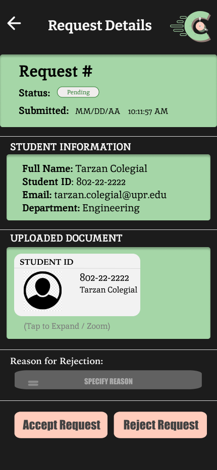
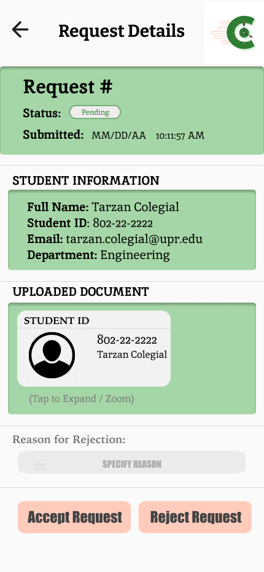

= Cafteria Odering System - Request Details Staff View Design

User: andreasegarra
Closes issue #169

== Purpose:
Design allows staff members to review a submitted verification request in detail, preview the uploaded document with an expand/zoom interaction cue, and take a final action to accept or reject the request. This design is based on the approved Request Detail View wireframe (see `documentation/wireframes/verification_request_staff_view/` for the wireframe and corresponding documentation.)

== Final product:
Final designs can be viewed in `documentation/designs/request_detail_staff_view_design/images/`.

=== Design Preview

==== Dark Mode

==== Light Mode

--
Design description:

- Designs were created for both light and dark mode.
- All elements follow the approved branding system, color palette, and typography hierarchy.
- The page header includes a back navigation arrow and the title "Request Details", with the system logo placed on the right for consistent branding.
- The top summary card displays:
  * Request identifier (Request #)
  * Current status (Pending / Approved / Rejected)
  * Submission date and time
- The "Student Information" section is visually separated and contains styled, readable fields:
  * Full Name
  * Student ID
  * Email
  * Department
- The "Uploaded Document" section includes a styled document preview component (ID-style card) that summarizes the submitted document.
- A zoom/expand interaction cue is included below the preview (e.g., “Tap to Expand / Zoom”) to communicate that staff can inspect the document in more detail.
- A styled "Reason for Rejection" input field is included to support staff feedback when rejecting requests.
- Primary and destructive actions are clearly separated at the bottom of the screen:
  * "Accept Request" serves as the primary approval action.
  * "Reject Request" serves as the destructive/secondary action.
- Status feedback states are supported through the status pill and consistent color semantics:
  * Green indicates pending/approved/confirm actions.
  * Red or muted error tones indicate rejection/destructive actions.
- Layout is mobile-first, vertically structured, and maintains consistent spacing, alignment, and card elevation for readability and accessibility.
--