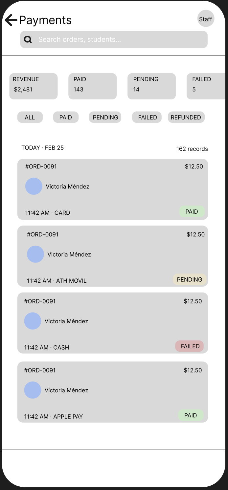
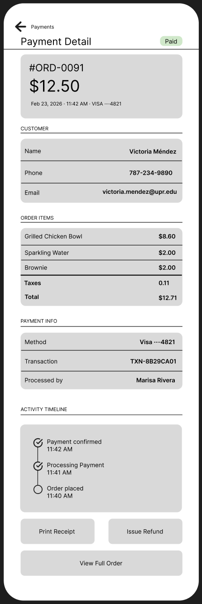

= View Payment Section (Staff View) — Wireframe Documentation
@daniellameleroo
:doctype: article
:toc: left
:toc-title: Table of Contents
:toclevels: 3
:sectnums:
:icons: font
:source-highlighter: highlight.js
:revdate: 2026-02-24

== Overview

This document describes the wireframe for the *View Payment Section (Staff View)* of the Cafeteria Ordering System.It covers two screens that staff members use to view, search, filter, and investigate customer payment records.

.Issue Details
[cols="1,2", options="header"]
|===
| Field | Value
| Assignee | @daniellameleroo
| Target Date | 2026-02-18
| Status | ✅ Complete
| Urgency | 5
| Difficulty | 4
| Wireframe File | `/wireframes/paystaff/paystaff-wireframe-iphone.html`
| Docs File | `/docs/wireframes.md`
|===

== Screen Summary

The wireframe comprises two screens forming a master–detail navigation flow.

[cols="1,2,2", options="header"]
|===
| Screen | Purpose | Key Elements
| Screen 1 | Payment List — main browse view for staff to scan all transactions | Search bar, stat pills, filter chips, payment cards, tab bar
| Screen 2 | Payment Detail — full breakdown of a single transaction | Hero card, customer info, order items, payment info, timeline, action buttons
|===

== Screen 1 — Payment List

Screen 1 is the primary view staff land on when navigating to the Payments section. It provides a scannable, filterable list of all payment records for the current day, with quick-access statistics at the top.

=== App Header

[cols="1,2", options="header"]
|===
| Element | Description
| Page Title | Large bold "Payments" heading anchors the screen context
| Staff Avatar | Circular initials avatar (e.g. "JS") in the top-right corner; identifies the logged-in staff member and links to Profile settings
| Search Bar | Full-width rounded field. Placeholder: "Search orders, students…". Filters payment cards in real-time by Order ID
|===

=== Summary Stat Pills

A horizontally scrollable row of four stat pills sits beneath the header, each showing a live count or value for the current day.

* *Revenue* — total dollar amount collected, displayed in navy blue
* *Paid* — count of confirmed transactions, displayed in green
* *Pending* — count of transactions awaiting confirmation, displayed in amber
* *Failed* — count of declined or errored transactions, displayed in red

Pills scroll horizontally if the screen width cannot accommodate all four simultaneously.

=== Status Filter Chips

A scrollable row of pill-shaped toggle buttons allows staff to quickly filter the list by status.

* All *(default active)*
* Paid
* Pending
* Failed
* Refunded

Multiple chips can be active at the same time. Tapping an active chip deselects it.

=== Payment Cards

Each payment record is displayed as a card containing the following fields.

[cols="1,2", options="header"]
|===
| Field | Description
| Order ID | Monospaced identifier (e.g. `#ORD-0091`) in navy, top-left of card
| Amount | Dollar value in monospaced bold (e.g. `$12.50`), top-right
| Customer Avatar | Small circular initials avatar, colour-coded per student
| Customer Name | Full name of the student (e.g. Alex Kim)
| Timestamp | Time of transaction (e.g. 11:42 AM), bottom-left with a separator dot
| Payment Method | Icon and label (e.g. 💳 Card, 🍽 Meal Plan, 📱 Mobile Pay, 💵 Cash)
| Status Badge | Colour-coded pill with a dot indicator and status label (see <<_status_indicators>>)
|===

The active/selected card is highlighted with a navy border and light blue background. Tapping any card navigates to Screen 2.

=== Bottom Tab Bar

A persistent tab bar at the bottom provides app-wide navigation.

* Dashboard
* Orders
* *Payments* _(active on this screen)_
* Menu
* Profile

== Screen 2 — Payment Detail

Screen 2 opens when a staff member taps a payment card on Screen 1. It presents a full breakdown of the selected transaction grouped into logical sections.

=== Header & Navigation

[cols="1,2", options="header"]
|===
| Element | Description
| Back button | "‹ Payments" link in navy at the top-left; returns to Screen 1 without losing scroll position
| Page title | Bold "Payment Detail" heading
| Status badge | Current payment status shown inline to the right of the title
|===

=== Hero Card

A full-width navy card at the top of the scrollable area provides an at-a-glance summary.

* Order ID in monospaced font (e.g. `#ORD-0091`)
* Total amount in large bold monospaced font (e.g. `$12.50`)
* Date, time, and payment method in smaller muted text (e.g. Feb 24, 2026 · 11:42 AM · 💳 Visa ····4821)

=== Customer Section

[cols="1,2", options="header"]
|===
| Field | Description
| Name | Full student name
| Email | University email address
|===

=== Order Items Section

An itemised list of all products in the order, each with its individual price. A total row at the bottom (separated by a thicker border) shows the sum, matching the hero card amount.

=== Payment Info Section

[cols="1,2", options="header"]
|===
| Field | Description
| Method | Payment method with last-four digits where applicable (e.g. 💳 Visa ····4821)
| Transaction Ref | Unique transaction reference in monospaced font (e.g. `TXN-8B29CA01`)
| Processed by | Name of the staff member who handled the transaction
|===

=== Activity Timeline

A vertical timeline shows the chronological sequence of events for the payment.

* Each event shows a timestamp (monospaced, muted), a dot indicator, and a description
* Completed steps use a solid green dot with a checkmark (✓)
* Pending or initial steps use an open amber circle
* A vertical line connects events visually

=== Action Buttons

Three action buttons are displayed in a grid at the bottom of the scrollable area.

[cols="1,1,2", options="header"]
|===
| Button | Style | Behaviour
| Print Receipt | Primary (navy fill) | Triggers a formatted receipt print/export for the transaction
| Issue Refund | Secondary (outlined) | Opens a confirmation modal to initiate a refund _(modal out of scope for this wireframe)_
| View Full Order | Full-width (light outlined) | Navigates to the Order Detail page linked to this payment
|===

== Status Indicators

Payment status is communicated through colour-coded badge components used consistently across both screens. Each badge contains a coloured dot and a text label.

[cols="1,1,2", options="header"]
|===
| Status | Colour | Meaning
| ✅ Paid | Green | Payment received and confirmed. Static green dot.
| ⏳ Pending | Amber | Awaiting payment confirmation. Dot pulses to signal active state.
| ❌ Failed | Red | Transaction was declined or an error occurred. Requires staff attention.
| 🔄 Refunded | Indigo | Payment has been returned to the customer.
|===

== Interaction Model

[cols="2,3", options="header"]
|===
| Interaction | Behaviour
| Tap payment card | Navigates from Screen 1 to Screen 2 for the selected record
| Back button (‹) | Returns from Screen 2 to the Screen 1 list
| Search bar | Filters the card list in real-time by Order ID, student name, or Student ID
| Status filter chips | Toggles visibility by status; multiple chips can be active simultaneously
| Print Receipt | Triggers a formatted receipt print/export
| Issue Refund | Opens a confirmation modal to initiate a refund
| View Full Order | Navigates to the Order Detail page for this payment
| Tab bar navigation | Switches between Dashboard, Orders, Payments, Menu, and Profile
|===

