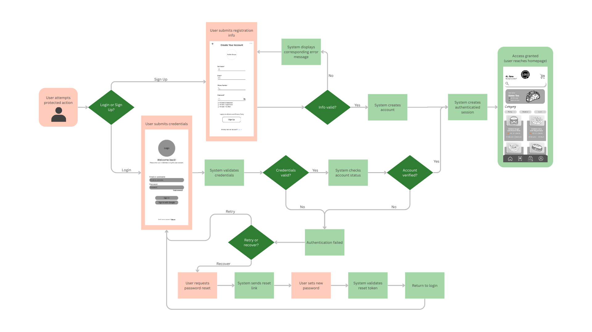

= Create Authentication Process Wireframe

Author: @FabiolaZTorres
// Issue: #138

== Purpose:
Wireframe displays full authentication flow from entry point to authenticated session through decision paths for valid processes, error handling, and password recovery. It features approved wireframes to give an accurate idea of where in the user's journey the steps take place. 

== Final product:
Final wireframe can be viewed in the `documentation/wireframes/authentication_process_wireframe/` folder in PDF and PNG formats.

[%unbreakable]
--
*Wireframe description:*

- Displays necessary steps taken by the user and system to create and log into preexisting accounts.
- Includes steps for handling valid and invalid credentials, failed authentications, and password recovery.
- Sign Up, Login, and Homepage wireframes indicate the UI displayed as the backend processes take place. Additional pages or pop-up windows may be designed to provide the user with more details on the authentication process.
- Wireframe makes use of professional diagram conventions:
    * rectangle: process
    * diamond: decision
    * rounded rectangle: start/end
- Steps are color coded to provide more details about the type of action it represents:
    * user actions: Pastel Peach (#FFCCBC)
    * system actions: Pastel Sage (#A5D6A7)
    * decisions: Primary Green (#2E7D32)

.Authentication process wireframe

--
 