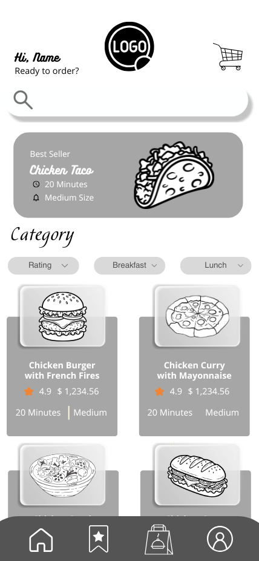

= Create HomePage Wireframe

Author: @andreasegarra
// Issue: #20

== Purpose:
Design a wireframe that outlines the structure, primary sections, and navigation of the Home Page.

This wireframe serves as a visual and structural guide for future UI design and frontend implementation. It defines how users interact with the main landing page after entering the application.

== Overview:
The Home Page functions as the primary landing area of the Cafeteria Ordering application.  
It organizes navigation, featured content, and interactive food elements in a clear and intuitive layout.

The goal is to ensure all components are properly labeled, logically grouped, and visually structured before development begins.

[%unbreakable]
--
*Wireframe description:*

- The header includes a greeting (e.g., "Hi, Name") and serves as the entry point for navigation.
- Category filters (e.g., Breakfast, Lunch) allow users to browse items by type.
- A featured or "Best Seller" section highlights popular menu options.
- Food cards display image, name, preparation time, rating, and price.
- Cards are interactive and allow users to select items for ordering.
- The layout prioritizes clarity, quick scanning, and smooth navigation.

