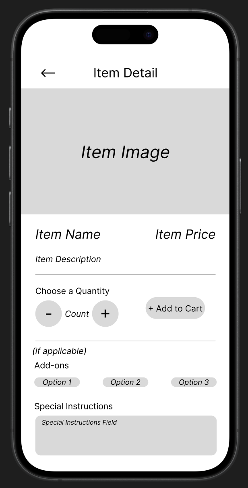

= Item Detail Page Wireframe = 
:toc:
:toclevels: 2

== Objective == 

Define the visual structure and layout of the Item Detail Page within the Cafeteria Ordering System mobile ordering flow.

This document describes the wireframe design and component placement that will guide future UI design and implementation.

== Wireframe Overview == 

The Item Detail Page wireframe represents the screen users see after selecting a specific item from the menu.

The purpose of this wireframe is to:

- Establish layout structure
- Define content hierarchy
- Clarify interactive elements
- Serve as reference for UI implementation

== Wireframe Structure ==

The Item Detail Page Wireframe is divided into the following primary sections:

=== 1. Return Button Section ===

Position:

- Top left of the screen

Includes:

- Button allowing users to return to the menu

=== 2. Item Information Section ===

Position:

- Upper portion of the screen

Includes:

- Item image
- Item name
- Item price
- Short item description 

=== 4. Quantity and Action Section ===

Position:

- Below Item Information

Includes:

- Quantity selector
- Primary "Add to Cart" button

=== 3. Customization Section (Conditional) ===

Position:

- Lower portion of the screen

Includes (if applicable):

- Add-ons or extras
- Special instructions field

This section only appears when customization is available for the selected item.

== Wifeframe File Reference ==

The wireframe is stored in:

/documentation/wireframes/item_detail_page_wireframe/item_detail_wireframe.png

Embedded Reference:

== Acceptance Criteria == 

- The wireframe clearly displays:

* Item image
* Item name
* Item price
* Item description

- Customization options are included when applicable
- A quantity selector is present and clearly visible
- A clearly labeled primary action button that allows an item to be added to the cart is included
- Navigation back to the menu is available
- The finalized wireframe image and this documentation file are accessible to all team members