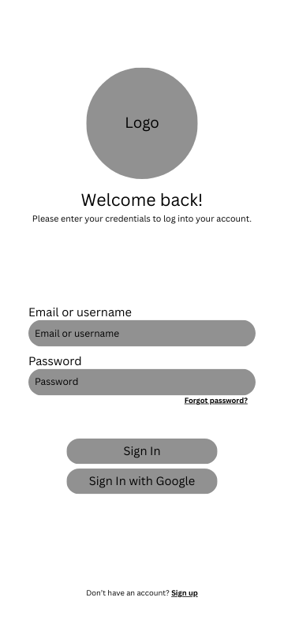

= Create Login Wireframe

Author: @FabiolaZTorres
// Issue: #17

== Purpose:
Layout displays fields for users to enter credentials, an option for signing in with alternate methods of authentication, and direct links to "Forgot password?" and "Sign Up" pages.

It ensures all core elements necessary for the login process are explicitly defined and properly labeled. 

== Final product:
Final wireframe can be viewed in the documentation/Wireframes and documentation/wireframes/login_wireframe folders in different formats.

[%unbreakable]
--
*Wireframe description:*

- Users will enter their credentials into "Email or username" and "Password" fields and then press the "Sign In" button submit this information and begin their session.
- "Sign In with Google" button allows users alternate methods for signing in. More methods can be added in the future in this way (e.g. Facebook, Apple).
- "Forgot password?" and "Sign up" links allow users to access those functionalities directly; the bolded and underlined letters represent said links.

--
 

