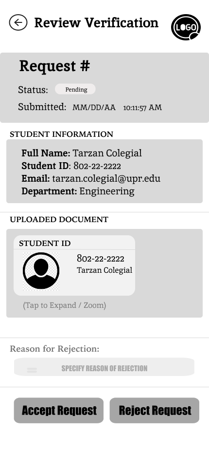

= Create Request Detail View Wireframe (Staff View)

Author: @andreasegarra
// Issue:#168

== Purpose:
Design a wireframe that outlines the structure and review actions for the Staff Request Detail View.

This wireframe serves as a visual and structural guide for how staff review verification requests when they click “Review” from the Requests list. It defines the required information display and approval/rejection controls before UI styling begins.

== Overview:
The Request Detail View allows staff to review a student’s verification submission and take one of two actions: approve or reject the request.

The layout ensures all required elements are present:
student information, uploaded document preview with zoom/expand option, action buttons, and an optional rejection reason input.

--
Wireframe description:

- *Top Navigation/Header:* Includes a back button to return to the Requests list and a title indicating the review context (e.g., "Review Verification").
- *Request Summary Section:* Displays request identifier (Request #), current status (e.g., Pending), and the submitted date/time for staff reference.
- *Student Information Section:* Shows key student fields needed for verification:
  - Full Name
  - Student ID
  - Email
  - Department

- *Uploaded Document Section:* Provides a document preview container to visually confirm the submission (e.g., student ID image).
- *Zoom/Expand Placeholder:* Includes an expand/zoom instruction (e.g., "Tap to Expand / Zoom") to indicate the ability to open the document in a larger view.
- *Rejection Reason (Optional):* A text input field labeled “Reason for Rejection” to capture a short explanation when rejecting.
- *Action Buttons:* Primary actions for staff:
  - "Accept Request" approves the verification request
  - "Reject Request" rejects the request (with rejection reason optionally provided)

Notes / Behavior:

  - The rejection reason input is optional, but recommended when rejecting to support transparency and auditing.
  - Approve and Reject are mutually exclusive actions and must update the request status (e.g., Approved or Rejected).
  - Once a request is approved or rejected, it should no longer appear in the "Pending" requests list.
  - Staff actions should trigger confirmation feedback (e.g., status update message or redirect).

--