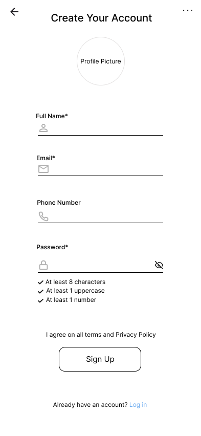
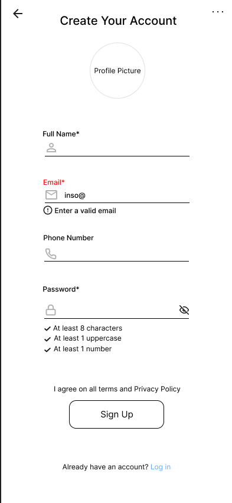
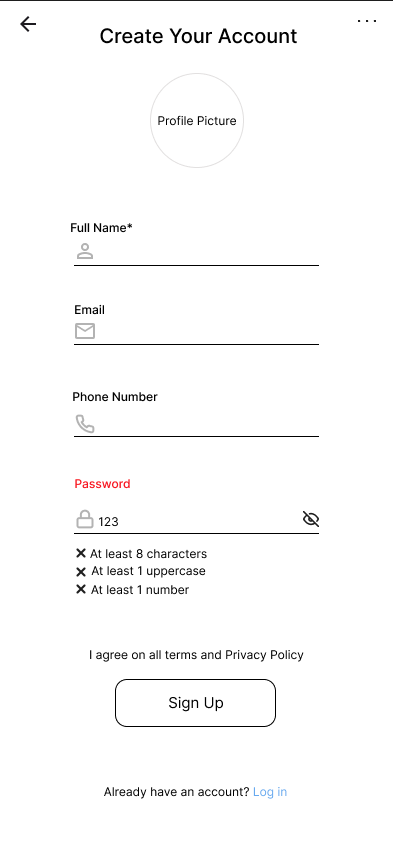

= Sign Up Page Wireframe
:project: Cafeteria Ordering System
:author: @daniellameleroo
:toc:
:toclevels: 2

== Overview

The Sign Up page allows new users to create an account in the Cafeteria Ordering System.  
This wireframe defines the layout, required fields, validation feedback, and navigation behavior.

The design prioritizes clarity, accessibility, and error prevention.

== Wireframe Location

documentation/wireframes/sign-up_wireframe

documentation/wireframes/sign-up_wireframe/Sign-up_wireframe1.png
documentation/wireframes/sign-up_wireframe/Sign-up_wireframe2.png
documentation/wireframes/sign-up_wireframe/Sign-up_wireframe3.png

== Screens

.Sign Up – Screen 1 (Empty / Default)

.Sign Up – Screen 2 (Email Errors)

.Sign Up – Screen 3 (Password Mismatch Error)

== Purpose

* Enable new users to register quickly and securely.
* Provide clear validation feedback.
* Ensure accessibility and ease of use.
* Offer navigation back to the login page.

== Layout Structure

=== Header
* Title: *Sign Up*
* Subtitle: Create your cafeteria ordering account

=== Registration Form

The form is presented inside a centered card container.

==== Required Fields

[cols="1,3"]
|===
| Field | Description

| Full Name *
| User’s first and last name

| Email *
| Used for login and notifications

| Password *
| Must meet minimum security requirements

| Confirm Password *
| Must comply with the password field requirements and match it
|===

NOTE: * indicates required field.

=== Password Helper Text

Displayed below the password field:

----
Must be at least 8 characters.
----

== Validation Feedback

Validation appears inline beneath the relevant field.

=== Required Field Error

----
⚠ Email is required
----

=== Invalid Email Format

----
⚠ Enter a valid email address
----

=== Password Requirements Error

----
⚠ Password must be at least 8 characters
----

=== Password Mismatch

----
⚠ Passwords do not match
----

=== Error State Styling (Wireframe Annotation)

* Red border appears on invalid input.
* Error message displayed below the field.
* Errors remain visible until corrected.

=== Optional Success Indicator

When input is valid:

* Green check indicator may appear.
* Error message disappears.

== Call-to-Action

Primary button:

----
Create Account
----

Behavior:

* Submits registration form.
* If errors exist, validation messages appear.
* If successful, user proceeds to next step.

== Navigation

Below the primary button:

----
Already have an account? Log in
----

Behavior:

* Navigates user to Login page.

== Submission Outcomes

=== Success
* Account created successfully.
* User may be:
** redirected to dashboard, OR
** prompted for email verification.

=== Failure
* Error banner may appear:

----
⚠ Something went wrong. Please try again.
----

* Field inputs remain intact.

== Accessibility Considerations

* Required fields indicated with text, not color alone.
* Error messages include clear instructions.
* Validation messages appear near the related field.
* Supports screen readers and keyboard navigation.

== Notes for Implementation

* Use inline validation on blur and submit.
* Maintain consistent spacing between fields.
* Ensure mobile responsiveness.
* Follow accessibility standards (WCAG).

== Status

Wireframe ready for design and implementation.