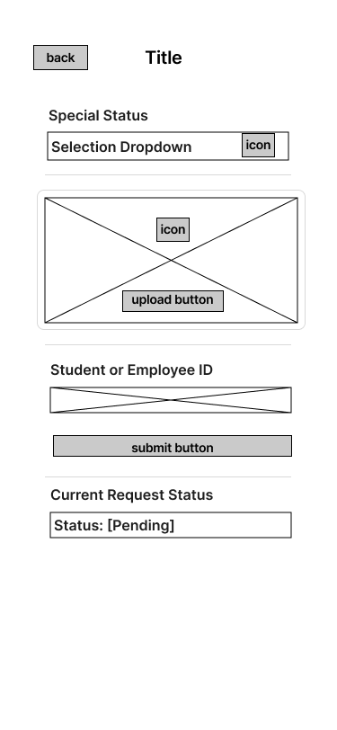

= Cafeteria Ordering System – Special Status Registration Wireframe (Customer)
:toc:
:toclevels: 2

== Objective

The objective of this document is to provide an overview of the Special Status Registration wireframe for the customer view. This includes a description of the page layout and required UI components for submitting a verification request.

== Page Overview

The Special Status Registration page allows customers (Employees, Athletes, etc.) to submit verification requests for special meal discounts.

The page presents a structured form layout that guides the user through the submission process.

=== Wireframe Preview

== Required UI Components

The wireframe includes the following required elements:

- *Status Selection Dropdown* – Allows the user to select a status type (Employee/Athlete/Other).
- *Upload Document Area* – Drag and drop zone/upload button for submitting verification documents.
- *Student or Employee ID Input Field* – Text field for entering identification number.
- *Submit Button* – Submits the verification request.
- *Status Badge Component* – Displays the current request state (Pending/Approved/Rejected).

== Layout Structure

The page follows a vertical form layout made up of:

- Back navigation
- Page title
- Status selection dropdown
- Document upload section
- ID input field
- Submit button
- Current request status display