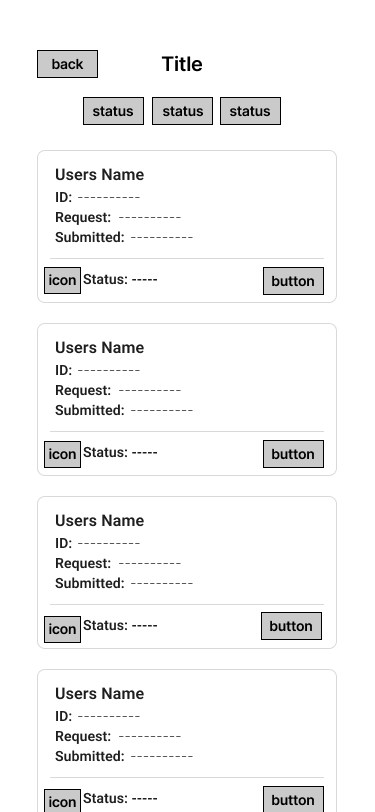

= Cafeteria Ordering System – Staff Verification Requests List Wireframe
:toc:
:toclevels: 2

== Objective
The objective of this document is to provide a structured overview of the Staff Verification Requests List wireframe. This includes a description of the page layout, request card components, and guidelines for application consistency.

== Page Overview

The Staff Verification Requests List page allows staff members to view and manage Special Status verification submissions. The page displays verification requests using a card layout that shows the most important information of the request.

=== Wireframe Preview

== Verification Request Card Elements

Each verification submission is displayed as a card containing:

- User Name – Primary identifier of the request.
- ID – Student or Employee identification number.
- Request – Requested status (Employee / Athlete / Other).
- Submitted – Date the request was submitted.
- Status Label – Displays current state (Pending/Approved/Rejected).
- Document Preview Icon – Placeholder icon representing the uploaded verification document.
- Review Button – Allows staff to open and review the full request.

== Layout Structure

The page follows a vertical list layout made up of:

- Back navigation
- Page title
- Status filter buttons (Pending/Approved/Rejected)
- Verification request cards
