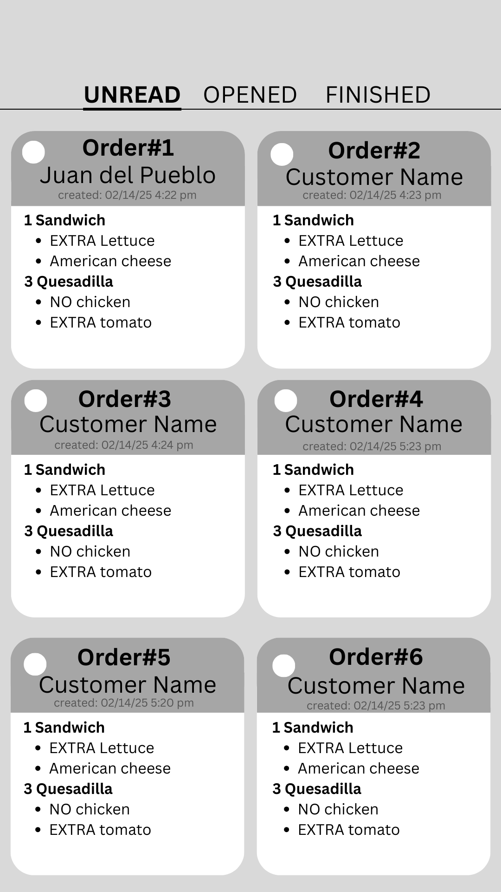
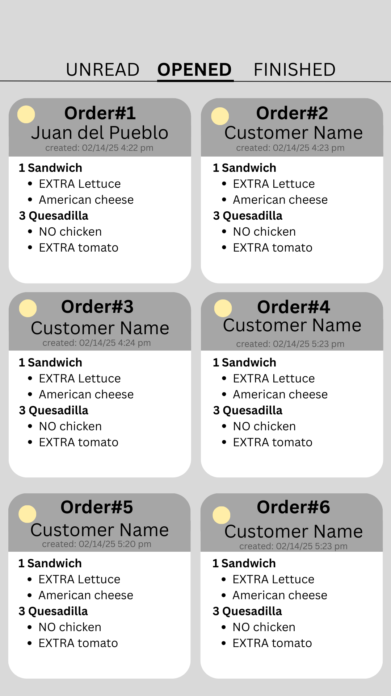
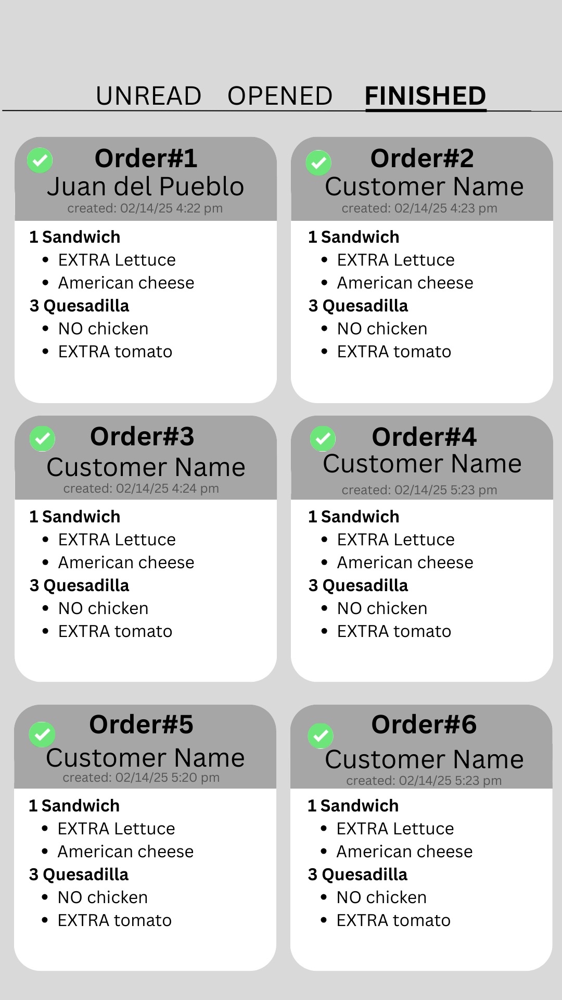
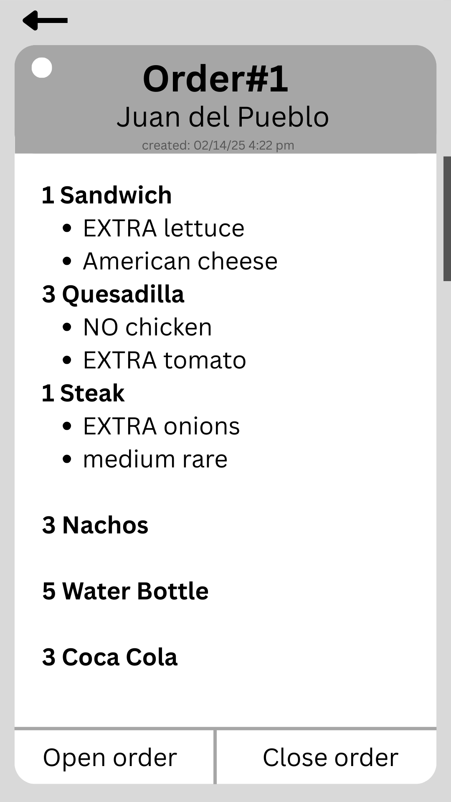
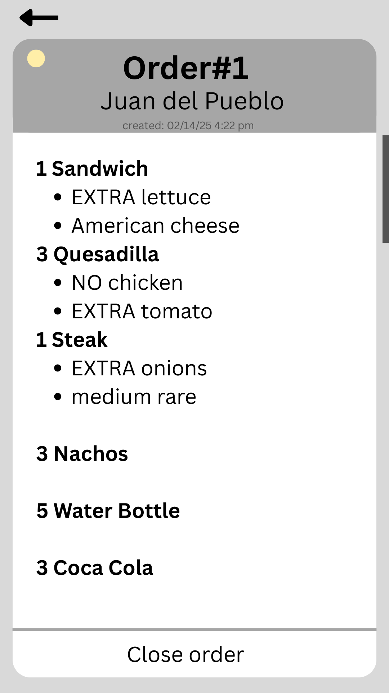

Create View Order Section Wireframe

author:
@nataliavera6

purpose:
Layout displays customer orders for staff members to access when preparing meals. It focuses on readability and organization to ensure fast comprehension, mistake-proofing, and order time reduction.

*Final product:*
All pages can be viewed in Wireframes/View Order Wireframe.pdf

[%unbreakable]
--
*Page 1:* The “Unread” tab features orders received and unread by staff. Once these orders are viewed by staff and sent to the kitchen, they can be marked as “Opened”. Each order can be tapped to open full order view, shown in page 4.

--
<<<
[%unbreakable]
--
*Page 2:* The “Opened” tab shows orders sent to the kitchen but not yet ready for pickup. Each order can be tapped to open full order view, shown in page 5.

--
<<<
[%unbreakable]
--
*Page 3:* The “Finished” tab shows orders that are ready and waiting for pick-up.

--
<<<
[%unbreakable]
--
*Page 4:* The “Full order view” for unread orders shows an enlarged view of the customer order and features two buttons at the bottom to close order or send order to the Opened tab.

--
<<<
[%unbreakable]
--
*Page 5:* The “Full order view” for opened orders shows an enlarged view of the customer order and features a button at the bottom to close orders.

--
 

